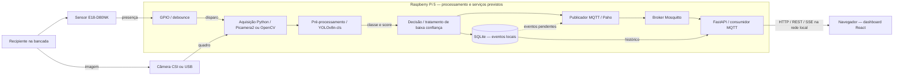

# Vigi

> **Sistema Embarcado para Inspeção e Triagem de Linhas de Envase**
> *Trabalho de Conclusão da Capacitação — PNAAT 2026 (FIT - Instituto de Tecnologia)*

---

## 🎯 Propósito do Sistema

O **Vigi** tem como propósito automatizar a inspeção visual e a triagem em tempo real de recipientes em esteiras de envase rápido, identificando preventivamente anomalias estruturais e defeitos de fechamento antes da etapa de empacotamento, de modo a evitar travamentos mecânicos no maquinário, desperdício de insumos por derramamento e paradas não programadas na linha de produção.

---

## 🏭 Descrição do Minimundo

Em uma fábrica com processo contínuo de envase e empacotamento, recipientes chegam à etapa final de embalagem apresentando anomalias estruturais e falhas de fechamento. A passagem dessas peças defeituosas gera travamentos mecânicos no maquinário de empacotamento secundário, exige paradas não programadas da linha, provoca derramamento de líquidos sobre a esteira e componentes elétricos, e resulta em perda de lotes e redução drástica da Eficiência Global do Equipamento (OEE).

Na solução proposta, o sistema **Vigi** atua como uma estação intermediária de inspeção não-intrusiva instalada na esteira de transporte. A passagem física de cada recipiente é detectada pelo sensor fotoelétrico infravermelho **E18-D80NK**, disparando a captura instantânea de imagem e a análise automatizada por visão computacional na borda (**Edge AI** com **Raspberry Pi 5**). Ao identificar uma não-conformidade, o sistema grava o evento no banco local **SQLite** e publica a telemetria e os alertas em tempo real via **MQTT** para supervisão no backend **FastAPI** e dashboard **React**.

---

## 🎯 Delimitação de Escopo (*Scope Boundaries*)

### Dentro do Escopo (*In-Scope*)

1. Detecção física determinística da passagem de recipientes na esteira de testes via sensor fotoelétrico infravermelho **E18-D80NK**.
2. Captura sincronizada de imagem do recipiente inspecionado no ponto focal.
3. Classificação automatizada entre recipientes conformes e não-conformes por visão computacional na borda (Edge AI na Raspberry Pi 5).
4. Persistência local transacional de eventos e histórico em banco embutido **SQLite** (*offline-first*).
5. Envio de telemetria e alertas via MQTT para o broker Mosquitto, com consumo pelo **FastAPI** e visualização no dashboard **React**.
6. Operação autônoma com sincronização de eventos pendentes após restabelecimento de conexão.

### Fora do Escopo (*Out-of-Scope*)

1. Atuação mecânica de braços ejetores, cilindros pneumáticos ou comandos de potência na bancada de testes.
2. Instalação e acionamento de atuadores físicos dedicados (torres luminosas e buzzers externos de painel).
3. Substituição de sistemas normatizados de segurança humana (NR-12).
4. Integração direta com sistemas corporativos de gestão (ERP/SAP).
5. Análise de parâmetros físico-químicos ou microbiológicos do líquido envasado.

---

## 🔄 Fluxo de Operação do Protótipo

Abaixo está representado o fluxo **proposto** de inspeção visual, processamento em borda, comunicação e consumo de dados do sistema **Vigi**. O diagrama descreve a arquitetura pretendida; não comprova a integração de todos os componentes.



A entrada é a presença física e a imagem do recipiente; o processamento produz uma classe (`CONFORME`, `SEM_TAMPA`, `TAMPA_TORTA` ou `AMASSADO`) e a decisão correspondente. As saídas previstas são eventos locais e informações de supervisão. A câmera também atende à coleta manual de imagens já disponível. Ver [arquitetura detalhada](docs/arquitetura/diagrama-arquitetural.md), [US01 e demais requisitos funcionais](docs/requisitos/02-requisitos-funcionais.md) e [requisitos técnicos](docs/requisitos/05-requisitos-tecnicos.md).

A figura complementar abaixo representa o fluxo do projeto:

<p align="center">
  
</p>

1. **Sensor Fotoelétrico (E18-D80NK):** Detecta a presença física do recipiente na esteira e dispara o gatilho de hardware.
2. **Câmera Digital:** Realiza a captura sincronizada do quadro focal do frasco posicionado.
3. **Raspberry Pi 5 (Edge AI):** Executa o pipeline de **Visão Computacional** e modelo de classificação para identificação de não-conformidades.
4. **Comunicação MQTT:** Transmite assincronamente os eventos de inspeção e telemetria para o broker Mosquitto.
5. **Consumo dos Dados:**
   * **SQLite:** Persistência local transacional dos registros de inspeção (*offline-first* com retenção de 30 dias).
   * **Backend Python:** O FastAPI consome MQTT, acessa o SQLite e fornece dados ao dashboard por REST/SSE. A camada de dados permanece em Python para manter o mesmo ecossistema do modelo de visão computacional.
   * **Frontend JavaScript:** O React apresenta indicadores, gráficos e alarmes no navegador, sem acessar diretamente o broker ou o banco de dados.

### Separação da stack

A arquitetura prevê **Python** para processamento de imagens, inferência do modelo, comunicação MQTT, persistência e API. Essa escolha reduz a quantidade de tecnologias na camada de dados e facilita o compartilhamento de modelos, validações e contratos entre o processamento em borda e o backend.

Para o frontend, estão previstos **JavaScript** e **React**. O React permite dividir o dashboard em componentes reutilizáveis, atualizar apenas os elementos afetados por novos eventos e integrar bibliotecas maduras como **Chart.js** e **Lucide**. Como o código é executado no navegador, o dashboard não adiciona uma segunda linguagem ao processamento de dados da Raspberry Pi.

---

## 👥 Equipe de Desenvolvimento

* **Alan Mendes Vieira**
* **Elder Rayan Oliveira Silva**
* **Leoncio Ferreira Flores Neto**
* **Samuel Wagner Tiburi Silveira**

---

## 📁 Estrutura do Repositório

```text
├── docs/
│   ├── arquitetura/            # Diagramas e especificações arquiteturais (Roger Pressman)
│   │   └── diagrama-arquitetural.md
│   ├── img/                    # Diagramas visuais e esquemáticos do sistema
│   │   └── Fluxo.jpeg
│   ├── pitch/
│   │   └── 01-roteiro-pitch.md  # Entrega 3: esboço do vídeo final de até 15 min
│   ├── poc/
│   │   └── 01-roteiro-video-poc.md # Entrega 2: demonstração de cerca de 5 min
│   └── requisitos/             # Especificação de Requisitos (IEEE 29148 / PNAAT)
│       ├── 01-regras-de-negocio.md
│       ├── 02-requisitos-funcionais.md
│       ├── 03-requisitos-nao-funcionais.md
│       └── 05-requisitos-tecnicos.md
├── edge/                        # Aplicação executada na Raspberry Pi
│   ├── config.py                # Configuração e argumentos do nó de borda
│   ├── acquisition/             # Contrato e backends de câmera
│   │   └── backends/            # Picamera2 e OpenCV/USB
│   ├── collection/              # Caso de uso de coleta do dataset
│   │   ├── controller.py        # Coordenação do fluxo de captura
│   │   ├── state.py             # Estado da sessão e classes
│   │   ├── image_store.py       # Gravação atômica dos JPEGs
│   │   ├── manifest.py          # Metadados da coleta
│   │   └── views/               # Interfaces OpenCV e terminal/SSH
│   ├── tools/
│   │   └── collect_dataset.py   # Composição da ferramenta
│   └── tests/                   # Testes unitários do Edge
├── scripts/
│   └── coletar_dataset.py       # Entrada compatível para a ferramenta modular
├── requirements.txt             # Dependência atual e anotações das previstas
├── .gitignore
└── README.md
```

---

## 📦 Dependências e estado da implementação — Entrega 4

O código disponível nesta revisão implementa a **coleta de imagens**, organizada em aquisição, controle de coleta, armazenamento e interfaces. A inferência está em finalização na [issue #11](https://github.com/eldrayan/Vigi-TCCPNAAT/issues/11), conforme o andamento informado pela equipe, e ainda não está neste checkout. Sensor, persistência de inspeções, MQTT, API e dashboard são partes previstas; não há comandos de inicialização desses módulos disponíveis nesta revisão.

### Hardware, plataformas e ferramentas

| Recurso | Função | Preparação / estado |
| --- | --- | --- |
| Raspberry Pi 5, fonte adequada e armazenamento para SO/dataset | Nó de borda | Plataforma alvo; validação física pendente nesta revisão documental |
| Raspberry Pi OS de 64 bits e Python 3.10 ou superior | Ambiente do coletor | Base prevista para a Pi 5; registrar versões reais no ensaio |
| Câmera CSI compatível ou webcam USB | Entrada de imagens | Backends implementados em [edge/acquisition](edge/acquisition) |
| Bancada, recipientes e iluminação estável | Aquisição de amostras | Preparar antes da coleta e dos vídeos |
| E18-D80NK e interface elétrica compatível com GPIO | Gatilho da inspeção | Integração prevista; coletor atual usa comandos manuais |
| Wi-Fi/Ethernet e navegador | Supervisão na rede local | Previstos para acesso ao backend/dashboard |
| Git | Obtenção e versionamento do código | Instalação inicial abaixo |
| Google Colab com GPU e dataset particionado | Treinamento do classificador | Previsto na issue #11; separado da execução local |
| Pesos treinados e imagens de avaliação | Inferência e validação | A entregar na issue #11; caminho e versão pendentes |
| Node.js e npm | Preparação/build do frontend | Previstos; versão e manifesto serão definidos com o frontend |
| Gravação de tela/bancada e YouTube | Produção do vídeo da PoC | Publicação não listada conforme Entrega 2 |

### Bibliotecas e serviços

| Dependência | Papel / relação com a arquitetura | Situação e forma de obtenção |
| --- | --- | --- |
| OpenCV (`cv2`) | Captura USB, qualidade, gravação e interface do coletor | Atual; `python3-opencv` via apt na Pi; nome pip `opencv-python` em [requirements.txt](requirements.txt) |
| Picamera2 / libcamera | Captura CSI | Atual, para CSI; `python3-picamera2` via apt e dependências do sistema |
| `unittest`, `csv`, `pathlib` e demais módulos padrão | Testes, manifesto e arquivos | Incluídos no Python, sem instalação pip |
| Ultralytics / YOLOv8n-cls | Treinamento e opção de runtime de inferência | Previsto na issue #11; TFLite é alternativa de exportação/runtime, a confirmar antes da instalação |
| GPIO Zero (`gpiozero`) | Leitura do sensor | Previsto; backend e compatibilidade com Pi 5 a validar na integração |
| SQLite / `sqlite3` | Persistência dos eventos e fila de sincronização | Previsto; módulo incluído no Python, sem pacote pip `sqlite3` |
| Paho MQTT (`paho-mqtt`) | Publicação e consumo dos eventos | Previsto; pacote Python |
| Mosquitto | Broker local de mensagens | Previsto; serviço do sistema, não pacote Python |
| FastAPI e Uvicorn | API e servidor para supervisão | Previstos; pacotes Python |
| React, Chart.js, Lucide e Sass/SCSS | Interface, gráficos, ícones e estilos | Previstos; dependências do futuro manifesto do frontend |

O `requirements.txt` contém a dependência externa do coletor para ambientes que usam pip e comentários identificando as dependências Python futuras. Ele **não instala o sistema integrado**, não substitui os pacotes de câmera do SO e ainda não fixa versões homologadas. Evita-se instalar módulos futuros sem o código que os utiliza. Ao integrar cada módulo, atualizar o manifesto e registrar as versões testadas; a lista completa de recursos atuais e previstos está acima.

### Preparação inicial na Raspberry Pi

1. Preparar o Raspberry Pi OS de 64 bits e conectar a câmera com a placa desligada.
   Para a coleta atual, o sensor de presença não é necessário.
2. No terminal da Raspberry Pi, instalar as dependências do coletor pelo sistema:

   ```bash
   sudo apt update
   sudo apt install -y git python3 python3-picamera2 python3-opencv
   ```

3. Obter o repositório e entrar na raiz (se já tiver um checkout, usá-lo):

   ```bash
   git clone https://github.com/eldrayan/Vigi-TCCPNAAT.git
   cd Vigi-TCCPNAAT
   ```

4. Conferir o Python, as bibliotecas e os argumentos disponíveis:

   ```bash
   python3 --version
   python3 -c "import cv2; from picamera2 import Picamera2; print('Bibliotecas disponíveis')"
   python3 scripts/coletar_dataset.py --help
   ```

5. Executar a coleta conforme a seção seguinte. Conferir a criação de JPEGs e do manifesto após uma captura válida. A importação acima não valida a câmera fisicamente; a captura na bancada é necessária.

Este caminho usa o Python do sistema. Não é necessário executar `pip install -r requirements.txt` por cima dos pacotes apt da câmera/OpenCV.
A instalação via apt segue a [orientação oficial do Picamera2](https://github.com/raspberrypi/picamera2#installation), que prioriza a compatibilidade com libcamera.

### Verificação local e limites do manual

Na raiz do projeto, os testes existentes podem ser executados com:

```bash
python3 -m unittest discover -s edge/tests -v
```

Os testes não substituem a captura física, a avaliação do modelo nem o teste do sistema completo. O requisito RNF12 de preparação em até 60 minutos ainda exige um ensaio em ambiente limpo com outra pessoa. Este esboço fornece a preparação do coletor disponível; o manual de inferência e dos serviços será completado quando seus módulos e configurações forem entregues.

---

## 📷 Coleta do Dataset na Raspberry Pi

O coletor serve exclusivamente para adquirir e organizar as imagens. Ele não
executa YOLO, inferência, treinamento ou classificação local. O backend padrão
usa a API `Picamera2` para ler diretamente a câmera CSI conectada à Raspberry
Pi; os JPEGs resultantes podem ser enviados posteriormente à plataforma externa
de classificação escolhida.

Após concluir a preparação inicial, use os comandos abaixo no Python do sistema.

Execute o coletor a partir da raiz do repositório:

```bash
python3 scripts/coletar_dataset.py --width 1280 --height 720
```

Quando executado por SSH ou em outro terminal sem ambiente gráfico, o coletor
detecta a ausência de `DISPLAY`/Wayland e ativa automaticamente o modo terminal.
Nesse modo, as mesmas teclas funcionam sem precisar pressionar `ENTER`, mas a
mira não é exibida. Também é possível forçar esse comportamento:

```bash
python3 scripts/coletar_dataset.py --headless --width 1280 --height 720
```

Para visualizar a mira, execute o comando em um terminal aberto na área de
trabalho gráfica da própria Raspberry Pi.

Para uma webcam USB, use:

```bash
python3 scripts/coletar_dataset.py --backend opencv --camera 0
```

Controles da janela:

| Tecla | Ação |
| :---: | :--- |
| `1`–`4` | Seleciona `conforme`, `sem_tampa`, `tampa_torta` ou `amassado` |
| `ESPAÇO` | Captura uma imagem |
| `B` | Liga ou desliga o modo burst |
| `N` | Inicia o registro de uma nova garrafa física |
| `C` | Alterna entre quadro completo e recorte da região guia |
| `Q` ou `ESC` | Encerra a coleta com segurança |

As imagens são gravadas em `dataset/raw/<classe>/`, nas pastas `01_conforme`,
`02_sem_tampa`, `03_tampa_torta` e `04_amassado`, conforme o
[estado da coleta](edge/collection/state.py). Esses nomes de diretório devem ser
conferidos com o mapeamento de classes do modelo exportado. O arquivo
`dataset/raw/manifest.csv` registra a sessão e a garrafa física de cada imagem.
Pressione `N` sempre que trocar a garrafa real: essa identificação permite que
o particionamento mantenha imagens correlacionadas no mesmo subconjunto e evita
vazamento entre treino e validação.

---

## 🎬 Entregas e documentação

| Entrega | Artefato / localização | Estado nesta revisão |
| --- | --- | --- |
| 2 — Apresentação da PoC | [Roteiro da demonstração de cerca de 5 min](docs/poc/01-roteiro-video-poc.md) | Roteiro preparado; ensaio, vídeo não listado e link pendentes |
| 3 — Esboço do vídeo pitch | [Roteiro textual do vídeo final de até 15 min](docs/pitch/01-roteiro-pitch.md) | Quatro partes com conteúdo, tempo e demonstração reservada; validação da equipe pendente |
| 4 — Esboço da documentação | Este README, [requirements.txt](requirements.txt), [arquitetura](docs/arquitetura/diagrama-arquitetural.md) e [requisitos](docs/requisitos) | Estrutura, blocos, dependências e preparação inicial documentados; validação física pendente |

**São dois vídeos diferentes:** a demonstração da PoC e o pitch final. A Entrega 3 solicita o texto que planeja o pitch; sua demonstração ocupa um bloco próprio dentro dos 15 minutos. Os documentos integram o trabalho da [issue #13](https://github.com/eldrayan/Vigi-TCCPNAAT/issues/13), sem declarar sua conclusão ou a validação pelo squad. A menção a Node-RED no texto da issue não corresponde à arquitetura atual, que prevê FastAPI e React.

Para localizar os materiais por tópico: regras em [01-regras-de-negocio.md](docs/requisitos/01-regras-de-negocio.md), comportamento em [02-requisitos-funcionais.md](docs/requisitos/02-requisitos-funcionais.md), critérios de validação em [03-requisitos-nao-funcionais.md](docs/requisitos/03-requisitos-nao-funcionais.md) e recursos em [05-requisitos-tecnicos.md](docs/requisitos/05-requisitos-tecnicos.md).
Os módulos de aquisição, coleta e testes correspondem às pastas `edge/` listadas na árvore; dataset é gerado em execução e ignorado pelo Git. Não há pastas de backend ou frontend implementadas neste checkout.

---

## 📄 Licença

Este projeto é desenvolvido para fins acadêmicos e educacionais no âmbito do programa PNAAT 2026. Consulte o arquivo [LICENSE](LICENSE) para mais detalhes.
