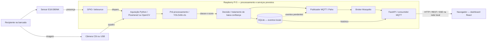
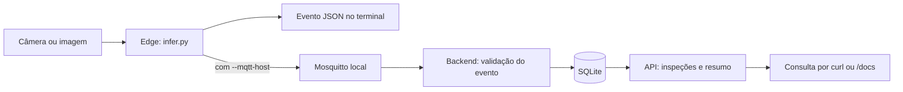

# Vigi

> **Sistema Embarcado para Inspeção e Triagem de Linhas de Envase**
> *Trabalho de Conclusão da Capacitação — PNAAT 2026 (FIT - Instituto de Tecnologia)*

---

## 🎯 Propósito do Sistema

O **Vigi** tem como propósito automatizar a inspeção visual e a triagem em tempo real de recipientes em esteiras de envase rápido, identificando preventivamente anomalias estruturais e defeitos de fechamento antes da etapa de empacotamento, de modo a evitar travamentos mecânicos no maquinário, desperdício de insumos por derramamento e paradas não programadas na linha de produção.

---

## 🏭 Descrição do Minimundo

Em uma fábrica com processo contínuo de envase e empacotamento, recipientes chegam à etapa final de embalagem apresentando anomalias estruturais e falhas de fechamento. A passagem dessas peças defeituosas gera travamentos mecânicos no maquinário de empacotamento secundário, exige paradas não programadas da linha, provoca derramamento de líquidos sobre a esteira e componentes elétricos, e resulta em perda de lotes e redução drástica da Eficiência Global do Equipamento (OEE).

Na solução proposta, o sistema **Vigi** atua como uma estação intermediária de inspeção não-intrusiva instalada na esteira de transporte. A passagem física de cada recipiente é detectada pelo sensor fotoelétrico infravermelho **E18-D80NK**, disparando a captura instantânea de imagem e a análise automatizada por visão computacional na borda (**Edge AI** com **Raspberry Pi 5**). Ao identificar uma não-conformidade, o sistema grava o evento no banco local **SQLite** e publica a telemetria e os alertas em tempo real via **MQTT** para supervisão no backend **FastAPI** e dashboard **React**.

---

## 🎯 Delimitação de Escopo (*Scope Boundaries*)

### Dentro do Escopo (*In-Scope*)

1. Detecção física determinística da passagem de recipientes na esteira de testes via sensor fotoelétrico infravermelho **E18-D80NK**.
2. Captura sincronizada de imagem do recipiente inspecionado no ponto focal.
3. Classificação automatizada entre recipientes conformes e não-conformes por visão computacional na borda (Edge AI na Raspberry Pi 5).
4. Persistência local transacional de eventos e histórico em banco embutido **SQLite** (*offline-first*).
5. Envio de telemetria e alertas via MQTT para o broker Mosquitto, com consumo pelo **FastAPI** e visualização no dashboard **React**.
6. Operação autônoma com sincronização de eventos pendentes após restabelecimento de conexão.

### Fora do Escopo (*Out-of-Scope*)

1. Atuação mecânica de braços ejetores, cilindros pneumáticos ou comandos de potência na bancada de testes.
2. Instalação e acionamento de atuadores físicos dedicados (torres luminosas e buzzers externos de painel).
3. Substituição de sistemas normatizados de segurança humana (NR-12).
4. Integração direta com sistemas corporativos de gestão (ERP/SAP).
5. Análise de parâmetros físico-químicos ou microbiológicos do líquido envasado.

---

## 🔄 Fluxo de Operação do Protótipo

Abaixo está representado o fluxo **proposto** de inspeção visual, processamento em borda, comunicação e consumo de dados do sistema **Vigi**. O diagrama descreve a arquitetura pretendida; não comprova a integração de todos os componentes.



A entrada é a presença física e a imagem do recipiente; o processamento produz uma classe (`CONFORME`, `SEM_TAMPA`, `TAMPA_TORTA` ou `AMASSADO`) e a decisão correspondente. As saídas previstas são eventos locais e informações de supervisão. A câmera também atende à coleta manual de imagens já disponível. Ver [arquitetura detalhada](docs/arquitetura/diagrama-arquitetural.md), [US01 e demais requisitos funcionais](docs/requisitos/02-requisitos-funcionais.md) e [requisitos técnicos](docs/requisitos/05-requisitos-tecnicos.md).

A figura complementar abaixo representa o fluxo do projeto:

<p align="center">
  
</p>

A figura e o Mermaid apresentam a arquitetura proposta, incluindo persistência independente do envio MQTT e alertas na interface. No código atual, o backend grava o evento após recebê-lo por MQTT; o fluxo implementado está descrito abaixo. Os alertas e a fila local no Edge ainda serão integrados. A ilustração não acrescenta torres luminosas ou buzzers físicos ao escopo.

1. **Sensor Fotoelétrico (E18-D80NK):** Detecta a presença física do recipiente na esteira e dispara o gatilho de hardware.
2. **Câmera Digital:** Realiza a captura sincronizada do quadro focal do frasco posicionado.
3. **Raspberry Pi 5 (Edge AI):** Executa o pipeline de **Visão Computacional** e modelo de classificação para identificação de não-conformidades.
4. **Comunicação MQTT:** Transmite assincronamente os eventos de inspeção e telemetria para o broker Mosquitto.
5. **Consumo dos Dados:**
   * **SQLite:** Persistência local transacional dos registros de inspeção (*offline-first* com retenção de 30 dias).
   * **Backend Python:** O FastAPI consome MQTT, acessa o SQLite e fornece dados ao dashboard por REST/SSE. A camada de dados permanece em Python para manter o mesmo ecossistema do modelo de visão computacional.
   * **Frontend JavaScript:** O React apresenta indicadores, gráficos e alarmes no navegador, sem acessar diretamente o broker ou o banco de dados.

### Organização em monólito modular

O backend do Vigi adota a organização de um monólito modular: uma única aplicação FastAPI reúne as funções de negócio, separadas em módulos com responsabilidades definidas. O módulo de inspeções concentra rotas, validação dos dados, serviços e persistência em `backend/app/modules/inspections/`. Configuração, banco e comunicação MQTT ficam na infraestrutura compartilhada.

Essa organização permite documentar cada responsabilidade junto do código correspondente e facilita a manutenção, sem exigir um serviço independente para cada função de negócio. A divisão por fluxo de dados dos diagramas complementa essa visão, mostrando como as informações passam entre os componentes.

Na execução da PoC, o Edge é um processo separado que publica eventos, e o Mosquitto é um serviço de infraestrutura. O termo monólito modular descreve a organização do backend; o sistema completo inclui esses componentes e o futuro frontend no navegador.

### Separação da stack

A arquitetura prevê **Python** para processamento de imagens, inferência do modelo, comunicação MQTT, persistência e API. Essa escolha reduz a quantidade de tecnologias na camada de dados e facilita o compartilhamento de modelos, validações e contratos entre o processamento em borda e o backend.

Para o frontend, estão previstos **JavaScript** e **React**. O React permite dividir o dashboard em componentes reutilizáveis, atualizar apenas os elementos afetados por novos eventos e integrar bibliotecas maduras como **Chart.js** e **Lucide**. Como o código é executado no navegador, o dashboard não adiciona uma segunda linguagem ao processamento de dados da Raspberry Pi.

---

## 👥 Equipe de Desenvolvimento

* **Alan Mendes Vieira**
* **Elder Rayan Oliveira Silva**
* **Leoncio Ferreira Flores Neto**
* **Samuel Wagner Tiburi Silveira**

---

## 📁 Estrutura do Repositório

```text
├── docs/
│   ├── arquitetura/diagrama-arquitetural.md # Arquitetura proposta
│   ├── img/                               # Fluxo e logos em logos/
│   ├── pitch/01-roteiro-pitch.md           # Entrega 3: pitch de até 15 min
│   ├── poc/01-roteiro-video-poc.md         # Entrega 2: PoC de cerca de 5 min
│   ├── requisitos/                        # Regras e requisitos do sistema
│   └── REPORTS.md                         # Contratos e leitura dos relatórios
├── edge/
│   ├── config.py                          # Configuração do coletor
│   ├── acquisition/backends/              # Picamera2 e OpenCV/USB
│   ├── collection/                        # Controle, estado, imagens e manifesto
│   │   └── views/                         # Interfaces gráfica e terminal
│   ├── inference/                         # Adaptador, motor e decisão da inferência
│   ├── messaging/                         # Evento de inspeção e publicação MQTT
│   ├── tools/collect_dataset.py           # Composição do coletor
│   └── tests/                             # Testes do coletor
├── backend/
│   ├── app/                               # API, consumidor MQTT e persistência
│   ├── migrations/                        # Migrations Alembic do SQLite
│   ├── tests/                             # DTOs e fluxo MQTT até a API
│   ├── Dockerfile                         # Serviço Python 3.12
│   ├── pyproject.toml                     # Dependências próprias do backend
│   └── uv.lock                            # Lock do backend
├── infra/mosquitto/mosquitto.conf          # Configuração do broker
├── compose.yaml                           # Backend, broker e volumes
├── Makefile                               # Atalhos de preparação e execução
├── .env.example                           # Valores de configuração de exemplo
├── model_lifecycle/                       # Dataset, avaliação, métricas e promoção
├── scripts/
│   ├── coletar_dataset.py
│   ├── verificar_ambiente.py
│   ├── validar_dataset.py
│   ├── treinar_modelo.py
│   ├── avaliar_modelo.py
│   ├── quality_gate.py
│   ├── promover_modelo.py
│   ├── infer.py
│   └── benchmark_modelo.py
├── tests/                                # Testes do modelo e das CLIs
├── training_configuration/               # Configurações baseline e tuned
├── dataset/vigi-cls.dvc                   # Ponteiro do dataset no DVC
├── models.dvc                            # Ponteiro dos modelos no DVC
├── .dvc/config                           # Configuração do armazenamento remoto
├── .github/workflows/mlops-ci.yml         # Qualidade e validação de artefatos
├── pyproject.toml                        # Dependências, extras e ferramentas
├── uv.lock                               # Versões resolvidas do ambiente
├── requirements.txt                      # Entrada pip para o projeto
├── TODO.md                               # Pendências técnicas
├── .gitignore
└── README.md
```

---

## 📦 Dependências e estado da implementação — Entrega 4

O repositório contém o coletor de imagens, o ciclo de treinamento, avaliação e promoção do modelo, além da inferência por imagem ou captura de câmera e do benchmark. Os módulos estão em `edge/`, `model_lifecycle/` e `scripts/`. Dataset e modelos são versionados por DVC; os ponteiros estão no Git, e os arquivos precisam ser recuperados do armazenamento remoto. A existência do código não substitui a validação física da inferência na Raspberry Pi.

Também estão implementados a publicação MQTT no Edge, o consumidor no backend, a persistência SQLite com migrations e as consultas HTTP. O fluxo atual é captura manual → inferência → evento MQTT → backend → SQLite → consulta pela API. Cada chamada da CLI executa uma inspeção. O dashboard React, os alarmes na interface, o SSE, a autenticação/autorização, o gatilho do sensor e a fila persistente de eventos no Edge continuam previstos.

O caminho disponível para demonstração é:



A API oferece `GET /health`, `GET /api/inspecoes` com paginação, `GET /api/inspecoes/resumo` e `GET /api/inspecoes/{id_inspecao}`. A página `/docs` permite explorar a API; ela não é o dashboard React.

### Operação local, case e supervisão

A arquitetura prevê que a Raspberry Pi execute a inspeção, a decisão e o armazenamento dos eventos localmente, com funcionamento independente de internet e sem envio de imagens à nuvem para inferência. Conforme a [RN04](docs/requisitos/01-regras-de-negocio.md), essas funções deverão continuar operando mesmo sem conexão com uma rede externa. A operação offline será testada de acordo com o [RNF03](docs/requisitos/03-requisitos-nao-funcionais.md), incluindo a continuidade das inspeções e a preservação dos registros locais.

Está prevista uma case para acomodar a Raspberry Pi e a câmera na bancada. A instalação também deverá considerar o sensor, a alimentação, os cabos, a fixação e a área necessária à captura das imagens. A disposição dos componentes e as dimensões do conjunto serão registradas durante a validação da montagem.

A execução prevista é independente de internet depois da preparação do ambiente, mas o fluxo atual de persistência requer o broker local funcionando. Sem `--mqtt-host`, a CLI imprime o evento sem gravá-lo em SQLite. Com publicação habilitada, uma falha no MQTT encerra a chamada com erro, sem fila persistente para reenvio no Edge. O RNF03 ainda precisa de implementação complementar e validação.

O dashboard está previsto para reunir resultados, histórico e alarmes para operadores e supervisores. O acesso por outros dispositivos será feito pela rede local, mediante conexão com a Raspberry Pi, sem necessidade de internet. Sua implementação deverá incluir autenticação dos usuários e autorização para controlar o acesso às informações e às funções disponíveis. A API já permite consultar os eventos, mas seus endpoints atuais não exigem autenticação. Os controles de acesso e a integração do painel serão implementados e verificados nas etapas correspondentes do projeto. O Compose publica a API na porta 8000 e o MQTT apenas no loopback do host por padrão.

O [roteiro do pitch](docs/pitch/01-roteiro-pitch.md) e o [roteiro da PoC](docs/poc/01-roteiro-video-poc.md) organizam a apresentação dos componentes conforme o andamento da implementação.

### Hardware, plataformas e ferramentas

| Recurso | Função | Preparação / estado |
| --- | --- | --- |
| Raspberry Pi 5, fonte adequada e armazenamento para SO/dataset | Nó de borda | Plataforma alvo; validação física pendente nesta revisão documental |
| Raspberry Pi OS de 64 bits e Python 3.11 a 3.13 no Edge | Ambiente do coletor | Edge: `>=3.11,<3.14`; backend: `>=3.12,<3.13`. Registrar as versões usadas na Pi |
| Câmera CSI compatível ou webcam USB | Entrada de imagens | Backends implementados em [edge/acquisition](edge/acquisition) |
| Case para Raspberry Pi e câmera | Acomodação do conjunto na bancada | Informada pela equipe; conteúdo, dimensões e montagem a confirmar no ensaio |
| Bancada, recipientes e iluminação estável | Aquisição de amostras | Preparar antes da coleta e dos vídeos |
| E18-D80NK e interface elétrica compatível com GPIO | Gatilho da inspeção | Integração prevista; coletor atual usa comandos manuais |
| Wi-Fi/Ethernet e navegador | Supervisão na rede local | Previstos para acesso ao backend/dashboard |
| Git | Obtenção e versionamento do código | Instalação inicial abaixo |
| GNU Make, Docker Engine com Compose e curl | Atalhos, backend/broker em containers e consultas de verificação | Necessários para o fluxo integrado; comandos de verificação abaixo |
| uv | Gerenciamento do ambiente Python | Dependências em `pyproject.toml` e versões em `uv.lock` |
| DVC com suporte SSH e acesso ao storage | Recuperação e versionamento de dataset/modelos | Extra `mlops`; acesso e chave configurados localmente |
| GitHub Actions e Tailscale | CI e acesso do workflow aos artefatos | Workflow em `.github/workflows/mlops-ci.yml`; requer os secrets descritos abaixo |
| Google Colab com GPU e dataset particionado | Treinamento do classificador | Ambiente possível de treinamento; scripts e configurações também estão disponíveis para execução local |
| Pesos treinados e imagens de avaliação | Inferência e validação | Ponteiro `models.dvc` disponível; recuperar os arquivos e conferir `models/active/manifest.json` antes do ensaio |
| Node.js e npm | Preparação/build do frontend | Previstos; versão e manifesto serão definidos com o frontend |
| Gravação de tela/bancada e YouTube | Produção do vídeo da PoC | Publicação não listada conforme Entrega 2 |

### Bibliotecas e serviços

| Dependência | Papel / relação com a arquitetura | Situação e forma de obtenção |
| --- | --- | --- |
| OpenCV (`cv2`) | Captura USB, qualidade, gravação e interface do coletor | Coletor via `python3-opencv` no sistema; no ambiente do projeto, `opencv-python` também é dependência transitiva do Ultralytics |
| Picamera2 / libcamera | Captura CSI | Atual, para CSI; `python3-picamera2` via apt e dependências do sistema |
| `unittest`, `csv`, `pathlib` e demais módulos padrão | Testes, manifesto e arquivos | Incluídos no Python, sem instalação pip |
| Ultralytics / YOLOv8n-cls | Treinamento e inferência | Implementados; runtime atual usa checkpoints `.pt`. TFLite não é suportado pelo fluxo atual de promoção |
| NumPy, Pillow, PyYAML, PyTorch e Torchvision | Dados, configurações e execução do modelo | Dependências diretas em `pyproject.toml`; PyTorch CPU selecionado no Linux e Windows |
| Matplotlib | Gráficos do treinamento | Extra `train` |
| DVC (`dvc[ssh]`) | Artefatos no storage remoto | Extra `mlops` |
| pytest e Ruff | Testes e lint | Grupo `dev` |
| GPIO Zero (`gpiozero`) | Leitura do sensor | Previsto; backend e compatibilidade com Pi 5 a validar na integração |
| SQLite, SQLAlchemy, aiosqlite e Alembic | Persistência das inspeções recebidas e migrations | Implementados no backend; fila persistente no Edge ainda prevista |
| Paho MQTT (`paho-mqtt`) | Publicação no Edge e consumo no backend | Implementados nos dois projetos Python |
| Mosquitto | Broker local de mensagens | Configurado no Compose, imagem `eclipse-mosquitto:2.0.22` |
| FastAPI, Uvicorn e pydantic-settings | API, servidor e configuração | Implementados; dependências em `backend/pyproject.toml` |
| React, Chart.js, Lucide e Sass/SCSS | Interface, gráficos, ícones e estilos | Previstos; dependências do futuro manifesto do frontend |

O [pyproject.toml](pyproject.toml) é a fonte das dependências Python do Edge e do ciclo do modelo; o [uv.lock](uv.lock) registra as versões resolvidas. O [requirements.txt](requirements.txt) aponta para o projeto local como alternativa de instalação via pip, sem duplicar a lista. Para reproduzir o ambiente, use os comandos com `uv sync --frozen` abaixo. Picamera2 e libcamera continuam sendo pacotes do sistema. O backend mantém seu próprio [pyproject.toml](backend/pyproject.toml) e [uv.lock](backend/uv.lock). O `requirements.txt` da raiz não instala o backend. O Compose prepara esse serviço pelo seu Dockerfile; as dependências do frontend serão incorporadas com sua implementação.

### Preparação do coletor na Raspberry Pi

1. Preparar o Raspberry Pi OS de 64 bits e conectar a câmera com a placa desligada.
   Para a coleta atual, o sensor de presença não é necessário.
2. No terminal da Raspberry Pi, instalar as dependências do coletor pelo sistema:

   ```bash
   sudo apt update
   sudo apt install -y git python3 python3-picamera2 python3-opencv
   ```

3. Obter o repositório e entrar na raiz (se já tiver um checkout, usá-lo):

   ```bash
   git clone https://github.com/eldrayan/Vigi-TCCPNAAT.git
   cd Vigi-TCCPNAAT
   ```

4. Conferir o Python, as bibliotecas e os argumentos disponíveis:

   ```bash
   python3 --version
   python3 -c "import cv2; from picamera2 import Picamera2; print('Bibliotecas disponíveis')"
   python3 scripts/coletar_dataset.py --help
   ```

5. Executar a coleta conforme a seção seguinte. Conferir a criação de JPEGs e do manifesto após uma captura válida. A importação acima não valida a câmera fisicamente; a captura na bancada é necessária.

Este caminho usa o Python do sistema. Não é necessário executar `pip install -r requirements.txt` por cima dos pacotes apt da câmera/OpenCV.
A instalação via apt segue a [orientação oficial do Picamera2](https://github.com/raspberrypi/picamera2#installation), que prioriza a compatibilidade com libcamera.

### Verificação local e limites do manual

Na raiz do projeto, os testes existentes podem ser executados com:

```bash
python3 -m unittest discover -s edge/tests -v
```

Para executar a suíte completa sem instalar o runtime de treinamento, com `uv` disponível:

```bash
uv sync --frozen --only-group dev
uv run --no-sync python -m pytest
uv run --no-sync ruff check .
```

Para os testes do backend em seu ambiente próprio:

```bash
cd backend
uv sync --frozen
uv run --no-sync python -m pytest tests -q
cd ..
```

O teste MQTT até a API exige um broker local e `VIGI_TEST_MQTT=1`; sem isso, ele é ignorado. Use um broker de teste separado, pois o teste publica no tópico de inspeções. O workflow já prepara esse ambiente isolado.

Os testes não substituem a captura física, a avaliação do modelo nem o teste do sistema completo. O requisito RNF12 de preparação em até 60 minutos ainda exige um ensaio em ambiente limpo com outra pessoa. A preparação do coletor está acima; treinamento, inferência e recuperação dos artefatos estão nas seções seguintes. As instruções do backend e do broker estão abaixo; as do dashboard serão acrescentadas quando ele for implementado.

---

## 📷 Coleta do Dataset na Raspberry Pi

O coletor serve exclusivamente para adquirir e organizar as imagens. Ele não
executa YOLO, inferência, treinamento ou classificação local. O backend padrão
usa a API `Picamera2` para ler diretamente a câmera CSI conectada à Raspberry
Pi; os JPEGs resultantes podem ser enviados posteriormente à plataforma externa
de classificação escolhida.

Após concluir a preparação inicial, use os comandos abaixo no Python do sistema.

Execute o coletor a partir da raiz do repositório:

```bash
python3 scripts/coletar_dataset.py --width 1280 --height 720
```

Quando executado por SSH ou em outro terminal sem ambiente gráfico, o coletor
detecta a ausência de `DISPLAY`/Wayland e ativa automaticamente o modo terminal.
Nesse modo, as mesmas teclas funcionam sem precisar pressionar `ENTER`, mas a
mira não é exibida. Também é possível forçar esse comportamento:

```bash
python3 scripts/coletar_dataset.py --headless --width 1280 --height 720
```

Para visualizar a mira, execute o comando em um terminal aberto na área de
trabalho gráfica da própria Raspberry Pi.

Para uma webcam USB, use:

```bash
python3 scripts/coletar_dataset.py --backend opencv --camera 0
```

Controles da janela:

| Tecla | Ação |
| :---: | :--- |
| `1`–`4` | Seleciona `conforme`, `sem_tampa`, `tampa_torta` ou `amassado` |
| `ESPAÇO` | Captura uma imagem |
| `B` | Liga ou desliga o modo burst |
| `N` | Inicia o registro de uma nova garrafa física |
| `C` | Alterna entre quadro completo e recorte da região guia |
| `Q` ou `ESC` | Encerra a coleta com segurança |

As imagens são gravadas em `dataset/raw/<classe>/`, nas pastas `01_conforme`,
`02_sem_tampa`, `03_tampa_torta` e `04_amassado`, conforme o
[estado da coleta](edge/collection/state.py). Esses nomes de diretório devem ser
conferidos com o mapeamento de classes do modelo exportado. O arquivo
`dataset/raw/manifest.csv` registra a sessão e a garrafa física de cada imagem.
Pressione `N` sempre que trocar a garrafa real: essa identificação permite que
o particionamento mantenha imagens correlacionadas no mesmo subconjunto e evita
vazamento entre treino e validação.

---

## 🧠 Treinamento e MLOps do classificador

O treinamento consome o dataset que já foi particionado e aumentado na
plataforma externa. Este repositório **não monta splits nem aplica data
augmentation adicional**. A estrutura esperada é:

```text
dataset/vigi-cls/
├── train/{01_conforme,02_sem_tampa,03_tampa_torta,04_amassado}/
├── val/{01_conforme,02_sem_tampa,03_tampa_torta,04_amassado}/
└── test/{01_conforme,02_sem_tampa,03_tampa_torta,04_amassado}/
```

### Ambiente local

Instale o `uv` conforme sua [documentação oficial](https://docs.astral.sh/uv/getting-started/installation/). Para treinamento, use Python 3.12 e instale os grupos necessários:

```bash
uv python install 3.12
uv sync --frozen --python 3.12 --extra train --extra mlops --group dev
uv run python scripts/verificar_ambiente.py
```

O preflight verifica Python, CUDA, DVC e SSH. O lock atual seleciona PyTorch CPU no Linux e Windows, enquanto o preflight exige CUDA para retornar sucesso. Portanto, esse comando sinalizará indisponibilidade de CUDA nesse ambiente; treinamento com GPU exige um ambiente/configuração compatível, ainda a validar. Isso não impede por si só o uso do runtime CPU para inferência.

### Versionamento dos artefatos

O Vigi reutiliza o mesmo storage remoto do `yolo-edge-api`:

```ini
[core]
    remote = local_remote
['remote "local_remote"']
    url = ssh://alan@100.67.236.30/home/alan/dvc-storage
```

Os ponteiros `dataset/vigi-cls.dvc` e `models.dvc` já estão versionados. Para consumir os artefatos, configure uma chave autorizada apenas localmente e recupere os arquivos:

```bash
uv run dvc remote modify --local local_remote keyfile /caminho/para/chave
uv run dvc pull dataset/vigi-cls.dvc models.dvc
```

O acesso ao storage exige conectividade com o endereço configurado e credenciais válidas. Para atualizar o dataset como responsável pela publicação, valide e envie os artefatos:

```bash
uv run dvc remote modify --local local_remote keyfile /caminho/para/chave
uv run python scripts/validar_dataset.py --dataset dataset/vigi-cls
uv run dvc add dataset/vigi-cls
uv run dvc push dataset/vigi-cls.dvc
git add dataset/vigi-cls.dvc .gitignore
```

Depois que modelos candidatos ou o modelo ativo existirem:

```bash
uv run dvc add models
uv run dvc push models.dvc
git add models.dvc .gitignore
```

Os arquivos binários nunca devem ser adicionados diretamente ao Git.

### Fine-tuning e avaliação

Execute a baseline e a configuração ajustada separadamente:

```bash
uv run python scripts/treinar_modelo.py \
  --dataset dataset/vigi-cls \
  --config training_configuration/training-baseline.yaml

uv run python scripts/treinar_modelo.py \
  --dataset dataset/vigi-cls \
  --config training_configuration/training-tuned.yaml
```

Calibre o limiar somente no split de validação e depois avalie uma única vez no
teste. A opção escolhida define o split automaticamente, sem permitir que o
usuário combine modos e splits incompatíveis:

```bash
uv run python scripts/avaliar_modelo.py \
  --model models/candidates/vigi-yolov8n-cls-tuned.pt \
  --dataset dataset/vigi-cls \
  --calibrate \
  --output reports/calibration

uv run python scripts/avaliar_modelo.py \
  --model models/candidates/vigi-yolov8n-cls-tuned.pt \
  --dataset dataset/vigi-cls \
  --calibration-report reports/calibration/metrics.json \
  --output reports/model-gate
```

`--calibrate` usa internamente o split `val`. `--calibration-report` usa o split
`test` e reaproveita automaticamente o limiar produzido pela calibração. O gate
exige acurácia de pelo menos 90%, falsos negativos de no máximo 10% e falsos
positivos de no máximo 15%. Com menos de 200 imagens de teste, o relatório é
marcado como provisório.

Promova somente um modelo aprovado:

```bash
uv run python scripts/promover_modelo.py \
  --model models/candidates/vigi-yolov8n-cls-tuned.pt \
  --metrics reports/model-gate/metrics.json
```

A promoção suporta somente checkpoints PyTorch `.pt` e usa obrigatoriamente o
`quality_gate.confidence_threshold` registrado no relatório final.

### Inferência e benchmark na Raspberry Pi 5

Para câmera CSI, instale os pacotes do sistema conforme a seção do coletor e use o Python de `/usr/bin/python3`, na faixa 3.11 a 3.13 aceita pelo Edge. O backend usa Python 3.12 em seu próprio ambiente/container. O `make setup-rpi` cria `.venv` com acesso aos pacotes do sistema apenas se o diretório ainda não existir; um ambiente criado antes sem esse acesso precisa ser revisto antes de usar Picamera2.

A [documentação do uv](https://docs.astral.sh/uv/reference/cli/#uv-venv) descreve `--system-site-packages`. Instalar outro interpretador não transfere os bindings da câmera. A compatibilidade das bibliotecas deve ser testada na Pi.

Antes de iniciar o fluxo integrado, confira as ferramentas instaladas:

```bash
make --version
docker --version
docker compose version
curl --version
uv --version
```

A instalação do Docker deve seguir a [documentação oficial](https://docs.docker.com/engine/install/) para o sistema da Pi. `make setup-rpi` instala dependências Python, não Docker nem os drivers de câmera. Execute o Compose a partir da raiz. Os valores padrão estão em [.env.example](.env.example); um `.env` local pode sobrescrevê-los. Se alterar portas ou tópicos, ajuste também os parâmetros `HOST`, `PORT` e `MODEL_TOPIC` dos comandos Make e as URLs de consulta.

Principais comandos `make`:

- `make help` — lista os comandos disponíveis.
- `make setup-rpi` — instala as dependências para executar na Raspberry.
- `make up` — constrói e inicia o backend e o Mosquitto.
- `make ps` — mostra o estado dos containers.
- `make logs` — acompanha os logs dos serviços.
- `make infer-camera` — captura uma imagem, executa a inferência e publica o resultado no MQTT.
- `make infer-image IMAGE=/caminho/imagem.jpg` — executa a inferência em uma imagem e publica o resultado no MQTT.
- `make mqtt-sub TOPIC=vigi/esteira/inspecoes` — acompanha os eventos de inspeção no MQTT.
- `make mqtt-pub TOPIC=vigi/teste MSG='Olá MQTT'` — envia uma mensagem de teste.
- `make migrate` — aplica as migrations pendentes do banco.
- `make down` — para e remove os containers, preservando os volumes de dados.

```bash
make setup-rpi

# Com acesso ao remote DVC da equipe:
uv sync --frozen --no-dev --extra mlops
uv run --no-sync dvc pull models.dvc

make up
make ps
# Aguarde o health retornar healthy antes de capturar:
curl -f http://localhost:8000/health
# Captura uma imagem, executa a inferência e publica o resultado no MQTT
make infer-camera

# Alternativa: executar uma imagem existente
make infer-image IMAGE=/caminho/imagem.jpg

curl -f 'http://localhost:8000/api/inspecoes?limit=1&offset=0'
curl -f http://localhost:8000/api/inspecoes/resumo
hostname -I
# No navegador do PC: http://IP_DA_RASPBERRY:8000/docs
```

Para executar somente a inferência, sem publicação MQTT, use diretamente a CLI sem `--mqtt-host`:

```bash
uv run python scripts/infer.py \
  --manifest models/active/manifest.json \
  --image imagem.jpg

uv run python scripts/infer.py \
  --manifest models/active/manifest.json \
  --camera 0 --backend picamera2
```

A CLI executa uma inspeção por chamada e imprime um evento JSON com `inspection_id`, `timestamp`, `result`, `category`, `nonconformity_type`, `technical_failure_type`, `confidence`, `processing_time_ms` e `model_format`. Os valores de domínio continuam em português, como `CONFORME` e `SEM_TAMPA`. `--mqtt-host` habilita a publicação com QoS 1, e os alvos `make infer-camera` e `make infer-image` já passam essa opção. A CLI não abre preview ou dashboard.

A confirmação de publicação no broker não comprova a gravação no SQLite. Consulte `/api/inspecoes/{id_inspecao}` com o `inspection_id` da saída para verificar o mesmo evento no banco. O backend aplica as migrations ao iniciar e usa um volume de dados no Compose. `make down` preserva os volumes; não use remoção de volumes para encerrar a demonstração.

Os contratos executáveis atuais estão em [edge/messaging/event.py](edge/messaging/event.py) e [DTOs do backend](backend/app/modules/inspections/dto). Os exemplos em português e a fila offline do [diagrama arquitetural](docs/arquitetura/diagrama-arquitetural.md) descrevem a proposta e ainda precisam ser atualizados para refletir integralmente a implementação.

O benchmark mede o tempo da chamada de predição do classificador, sem a detecção pelo sensor, a captura da câmera e a entrega ao dashboard. Portanto, é uma medição parcial e não comprova sozinho o RNF01 ponta a ponta. Ele descarta o aquecimento das estatísticas, reprova qualquer erro de
inferência e exige que pelo menos 95% das medições terminem em até 500 ms, sem
nenhuma ultrapassar 1.000 ms:

```bash
uv run python scripts/benchmark_modelo.py \
  --manifest models/active/manifest.json \
  --images dataset/vigi-cls/test \
  --runs 100 --warmup 10 \
  --output reports/benchmark-pi.json
```

### Relatórios e artefatos gerados

| Artefato | Finalidade |
| --- | --- |
| `best.pt` | Melhor estado aprendido pelo modelo durante o treinamento |
| `vigi-training-summary.json` | Registra como o treinamento foi executado |
| `predictions.csv` | Resultado individual da classificação de cada imagem |
| `metrics.json` | Qualidade agregada e limiar de confiança avaliado |
| `confusion-matrix.png` | Diagnóstico visual dos erros entre classes |
| `manifest.json` | Contrato do modelo que será usado em produção |
| `benchmark-pi.json` | Desempenho temporal do modelo no hardware de borda |

Consulte [`docs/REPORTS.md`](docs/REPORTS.md) para entender como cada arquivo é
produzido e utilizado no ciclo de treinamento, avaliação e promoção do modelo.

### Pipeline do GitHub Actions

O workflow `.github/workflows/mlops-ci.yml` executa a cadeia de qualidade, artefatos e modelo abaixo, além de um job separado de testes do backend com broker MQTT:

1. **Lint & Tests:** Ruff, testes e smoke das CLIs, sem acessar o Pi.
2. **ML Artifact Check:** conecta ao Tailscale, recupera dataset/modelos pelo
   DVC e valida a integridade dos artefatos.
3. **Model Quality Gate:** reavalia o modelo ativo no conjunto de teste e
   publica métricas e matriz de confusão como artifact do workflow.

Configure no GitHub os secrets `TS_OAUTH_CLIENT_ID`, `TS_OAUTH_SECRET`,
`RPI_SSH_KEY` e `RPI_KNOWN_HOSTS`. O primeiro secret SSH contém a chave privada
do cliente de CI; o segundo contém a chave pública de host da Raspberry Pi no
formato de `known_hosts`. Enquanto `dataset/vigi-cls.dvc` e `models.dvc` ainda não
existirem, os dois gates de ML informam que aguardam os primeiros artefatos e
encerram com sucesso. O job do backend inicia um broker Docker de teste; a execução local usa Compose. O workflow não publica uma imagem do projeto no GHCR nem faz deploy automático na Raspberry Pi.

---

## 🎬 Entregas e documentação

| Entrega | Artefato / localização | Estado nesta revisão |
| --- | --- | --- |
| 2 — Apresentação da PoC | [Roteiro da demonstração de cerca de 5 min](docs/poc/01-roteiro-video-poc.md) | Roteiro preparado; ensaio, vídeo não listado e link pendentes |
| 3 — Esboço do vídeo pitch | [Roteiro textual do vídeo final de até 15 min](docs/pitch/01-roteiro-pitch.md) | Quatro partes com conteúdo, tempo e demonstração reservada; validação da equipe pendente |
| 4 — Esboço da documentação | Este README, [pyproject.toml](pyproject.toml), [uv.lock](uv.lock), [requirements.txt](requirements.txt), [arquitetura](docs/arquitetura/diagrama-arquitetural.md) e [requisitos](docs/requisitos) | Estrutura, blocos, dependências e preparação inicial documentados; validação física pendente |

**São dois vídeos diferentes:** a demonstração da PoC e o pitch final. A Entrega 3 solicita o texto que planeja o pitch; sua demonstração ocupa um bloco próprio dentro dos 15 minutos. Os documentos integram o trabalho da [issue #13](https://github.com/eldrayan/Vigi-TCCPNAAT/issues/13), sem declarar sua conclusão ou a validação pelo squad. A menção a Node-RED no texto da issue não corresponde à arquitetura atual, que prevê FastAPI e React.

Para localizar os materiais por tópico: regras em [01-regras-de-negocio.md](docs/requisitos/01-regras-de-negocio.md), comportamento em [02-requisitos-funcionais.md](docs/requisitos/02-requisitos-funcionais.md), critérios de validação em [03-requisitos-nao-funcionais.md](docs/requisitos/03-requisitos-nao-funcionais.md) e recursos em [05-requisitos-tecnicos.md](docs/requisitos/05-requisitos-tecnicos.md).
Os módulos de aquisição, coleta e inferência estão em `edge/`, e o ciclo do modelo está em `model_lifecycle/`. As imagens brutas da coleta são geradas em execução; o dataset de classificação e os modelos têm ponteiros DVC versionados, com binários fora do Git. O backend está em `backend/`; o frontend ainda não está implementado neste checkout.

---

## 📄 Licença

Este projeto é desenvolvido para fins acadêmicos e educacionais no âmbito do programa PNAAT 2026. Consulte o arquivo [LICENSE](LICENSE) para mais detalhes.
