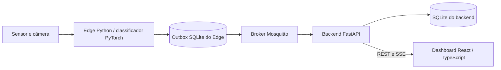

# Vigi

> **Sistema Embarcado para Inspeção e Triagem de Linhas de Envase**
> *Trabalho de Conclusão da Capacitação — PNAAT 2026 (FIT - Instituto de Tecnologia)*

---

## 🎯 Propósito do Sistema

O **Vigi** tem como propósito automatizar a inspeção visual e a triagem em tempo real de recipientes em esteiras de envase rápido, identificando preventivamente anomalias estruturais e defeitos de fechamento antes da etapa de empacotamento, de modo a evitar travamentos mecânicos no maquinário, desperdício de insumos por derramamento e paradas não programadas na linha de produção.

---

## 🏭 Descrição do Minimundo

Em uma fábrica com processo contínuo de envase e empacotamento, recipientes chegam à etapa final de embalagem apresentando anomalias estruturais e falhas de fechamento. A passagem dessas peças defeituosas gera travamentos mecânicos no maquinário de empacotamento secundário, exige paradas não programadas da linha, provoca derramamento de líquidos sobre a esteira e componentes elétricos, e resulta em perda de lotes e redução drástica da Eficiência Global do Equipamento (OEE).

O sistema **Vigi** atua como uma estação intermediária de inspeção não-intrusiva instalada na esteira de transporte. A passagem física de cada recipiente é detectada pelo sensor fotoelétrico infravermelho **E18-D80NK**, disparando a captura instantânea de imagem e a análise automatizada por visão computacional na borda (**Edge AI** com **Raspberry Pi 5**). Ao identificar uma não-conformidade, o sistema grava o evento no banco local **SQLite** e publica a telemetria e os alertas em tempo real via **MQTT** para supervisão no backend **FastAPI** e dashboard **React**.

---

## 🎯 Delimitação de Escopo (*Scope Boundaries*)

### Dentro do Escopo (*In-Scope*):
1. Detecção física determinística da passagem de recipientes na esteira de testes via sensor fotoelétrico infravermelho **E18-D80NK**.
2. Captura sincronizada de imagem do recipiente inspecionado no ponto focal.
3. Classificação automatizada entre recipientes conformes e não-conformes por visão computacional na borda (Edge AI na Raspberry Pi 5).
4. Persistência local transacional de eventos e histórico em banco embutido **SQLite** (*offline-first*).
5. Envio de telemetria e alertas via MQTT para o broker Mosquitto, com consumo pelo **FastAPI** e visualização no dashboard **React**.
6. Operação autônoma com sincronização de eventos pendentes após restabelecimento de conexão.

### Fora do Escopo (*Out-of-Scope*):
1. Atuação mecânica de braços ejetores, cilindros pneumáticos ou comandos de potência na bancada de testes.
2. Instalação e acionamento de atuadores físicos dedicados (torres luminosas e buzzers externos de painel).
3. Substituição de sistemas normatizados de segurança humana (NR-12).
4. Integração direta com sistemas corporativos de gestão (ERP/SAP).
5. Análise de parâmetros físico-químicos ou microbiológicos do líquido envasado.

---

## Arquitetura e documentação



O Edge e o backend são processos separados. O backend é um monólito modular
com módulos de inspeções, operações e alarmes. Seu banco não é a outbox do Edge.
A confirmação de publicação MQTT não comprova que o backend persistiu a inspeção:
confira também o histórico da API ou do dashboard.

- [Arquitetura, contratos e fluxos](docs/arquitetura/diagrama-arquitetural.md)
- [Montagem e limites da validação elétrica](docs/esquematico/esquematico-eletrico.md)
- [Recuperação de modelos e datasets](docs/dvc-dagshub.md)
- [Manual do dashboard e diagnóstico](docs/operacao/02-dashboard-e-diagnostico.md)
- [Múltiplas estações](docs/operacao/01-multiplas-estacoes.md)
- [Matriz de aceitação e verificações da Entrega 6](docs/validacao-entrega-6.md)

## Instalação inicial para operação

O caminho principal usa uma Raspberry Pi 5 com Raspberry Pi OS **64 bits**, câmera
CSI compatível com Picamera2 (ou webcam USB/OpenCV), sensor E18-D80NK e rede local.
Consulte o manual elétrico antes de conectar o sensor: o circuito registrado ainda
precisa de validação física. Não há ejeção mecânica implementada.

É necessário armazenamento para o sistema, ambiente Python, imagens Docker, modelo,
bancos e capturas opcionais. Não há capacidade mínima medida nesta revisão; verifique
`df -h` e dimensione a retenção/capturas para a bancada. Use alimentação e refrigeração
adequadas à Raspberry Pi 5, conforme a documentação do fabricante.

O Edge aceita Python 3.11–3.13; para CSI, use `/usr/bin/python3` e os bindings da
distribuição. A versão exata do Raspberry Pi OS e a combinação câmera/cabo devem
ser registradas no ensaio de bancada. Não se exige GPU CUDA nem treinamento para operar.

```bash
sudo apt update
sudo apt install -y git make curl python3-venv python3-picamera2 python3-opencv python3-lgpio
```

Instale [Docker Engine e o plugin Compose para Debian](https://docs.docker.com/engine/install/debian/)
seguindo o procedimento oficial compatível com a versão do sistema. Confira também
os [passos de acesso ao daemon](https://docs.docker.com/engine/install/linux-postinstall/):
os comandos abaixo pressupõem que seu usuário consegue executar `docker info`.
O grupo `docker` concede privilégios equivalentes a root; use apenas uma conta autorizada.

Instale o `uv` pelo [instalador oficial](https://docs.astral.sh/uv/getting-started/installation/):

```bash
curl -LsSf https://astral.sh/uv/install.sh -o /tmp/vigi-install-uv.sh
sh /tmp/vigi-install-uv.sh
export PATH="$HOME/.local/bin:$PATH"
git clone https://github.com/eldrayan/Vigi-TCCPNAAT.git
cd Vigi-TCCPNAAT
uv --version
docker info
docker compose version
make setup-rpi
```

Comece em um clone sem `.venv`: `make setup-rpi` só cria o ambiente com
`--system-site-packages` se ele ainda não existir. Para preservar um ambiente anterior
incompatível, renomeie-o antes de repetir o setup, por exemplo
`mv .venv .venv.backup-antes-csi` (escolha um destino que ainda não exista).
Confirme o acesso aos drivers:

```bash
uv run --no-sync python -c 'import picamera2, cv2, lgpio; print("Drivers disponíveis")'
```

Para webcam USB, Picamera2 não é o backend usado; configure `CAMERA_BACKEND=opencv`.
Siga agora [Reprodução ponta a ponta](#reprodução-ponta-a-ponta), começando pela
recuperação do modelo. As seções de coleta e treinamento são opcionais para operação.

---

## 👥 Equipe de Desenvolvimento

* **Alan Mendes Vieira**
* **Elder Rayan Oliveira Silva**
* **Leoncio Ferreira Flores Neto**
* **Samuel Wagner Tiburi Silveira**

---

## 📁 Estrutura do Repositório

```text
backend/             # FastAPI: módulos, infraestrutura, migrations e testes
frontend/            # Dashboard React/TypeScript e proxy Nginx
edge/                # Aquisição, inferência, mensageria e orquestração
model_lifecycle/     # Dataset, manifesto, métricas e avaliação
scripts/             # Entradas CLI de operação, coleta e MLOps
infra/mosquitto/      # Broker autenticado e ACL por estação
docs/                # Arquitetura, hardware, operação e requisitos
training_configuration/ # Configurações de treinamento
compose.yaml         # Backend, broker e frontend
Makefile             # Comandos reproduzíveis
pyproject.toml       # Dependências Python; uv.lock fixa resoluções
models.dvc           # Ponteiro dos modelos, não contém os pesos
```

---

## 📷 Coleta do Dataset na Raspberry Pi

O coletor serve exclusivamente para adquirir e organizar as imagens. Ele não
executa YOLO, inferência, treinamento ou classificação local. O backend padrão
usa a API `Picamera2` para ler diretamente a câmera CSI conectada à Raspberry
Pi; os JPEGs resultantes podem ser enviados posteriormente à plataforma externa
de classificação escolhida.

No Raspberry Pi OS, instale as dependências no Python do sistema:

```bash
sudo apt update
sudo apt install -y python3-picamera2 python3-opencv
```

Execute o coletor a partir da raiz do repositório:

```bash
python3 scripts/coletar_dataset.py --width 1280 --height 720
# ou, pelo Makefile:
make collect COLLECT_ARGS="--width 1280 --height 720"
```

As linhas exibidas por `make help` são exemplos de comandos. Execute somente a
linha desejada; não use `make make setup ...` nem copie o texto descritivo.

Quando executado por SSH ou em outro terminal sem ambiente gráfico, o coletor
detecta a ausência de `DISPLAY`/Wayland e ativa automaticamente o modo terminal.
Nesse modo, as mesmas teclas funcionam sem precisar pressionar `ENTER`, mas a
mira não é exibida. Também é possível forçar esse comportamento:

```bash
python3 scripts/coletar_dataset.py --headless --width 1280 --height 720
```

Para visualizar a mira, execute o comando em um terminal aberto na área de
trabalho gráfica da própria Raspberry Pi.

Para uma webcam USB, use:

```bash
python3 scripts/coletar_dataset.py --backend opencv --camera 0
```

Controles da janela:

| Tecla | Ação |
| :---: | :--- |
| `1`–`4` | Seleciona `conforme`, `sem_tampa`, `tampa_torta` ou `amassado` |
| `ESPAÇO` | Captura uma imagem |
| `B` | Liga ou desliga o modo burst |
| `N` | Inicia o registro de uma nova garrafa física |
| `C` | Alterna entre quadro completo e recorte da região guia |
| `Q` ou `ESC` | Encerra a coleta com segurança |

As imagens são gravadas em `dataset/raw/<classe>/`. O arquivo
`dataset/raw/manifest.csv` registra a sessão e a garrafa física de cada imagem.
Pressione `N` sempre que trocar a garrafa real: essa identificação permite que
o particionamento mantenha imagens correlacionadas no mesmo subconjunto e evita
vazamento entre treino e validação.

---

## 🧠 Treinamento e MLOps do classificador

O treinamento consome o dataset que já foi particionado e aumentado na
plataforma externa. Este repositório **não monta splits nem aplica data
augmentation adicional**. A estrutura esperada é:

```text
dataset/vigi-cls/
├── train/{01_conforme,02_sem_tampa,03_tampa_torta,04_amassado}/
├── val/{01_conforme,02_sem_tampa,03_tampa_torta,04_amassado}/
└── test/{01_conforme,02_sem_tampa,03_tampa_torta,04_amassado}/
```

### Ambiente local

Use Python 3.12 e instale os grupos necessários com `uv`:

```bash
uv python install 3.12
uv sync --python 3.12 --extra train --group dev
uv run python scripts/verificar_ambiente.py
```

O preflight confirma a versão do Python, a disponibilidade de CUDA no PyTorch,
o DVC e o cliente DagsHub antes de iniciar um treinamento longo.

### Versionamento dos artefatos

O DagsHub é o único remoto DVC do projeto. Para publicar artefatos ou
baixá-los em um clone, siga [`docs/dvc-dagshub.md`](docs/dvc-dagshub.md).
O login do cliente DagsHub não é repassado automaticamente ao DVC: use o
script indicado no guia.

```ini
[core]
    remote = dagshub
[remote "dagshub"]
    url = s3://dvc
    endpointurl = https://dagshub.com/alan-mendes-ufca/Vigi-TCCPNAAT.s3
```

Para baixar dataset e modelos depois do clone:

```bash
uv sync
uv run dagshub login
uv run python scripts/dvc_dagshub.py pull
```

Somente mantenedores devem publicar novas versões. Para o dataset, valide
e envie nesta ordem:

```bash
uv run python scripts/validar_dataset.py --dataset dataset/vigi-cls
uv run dvc add dataset/vigi-cls
uv run python scripts/dvc_dagshub.py push dataset/vigi-cls.dvc
git add dataset/vigi-cls.dvc .gitignore
```

Depois que modelos candidatos ou o modelo ativo existirem:

```bash
uv run dvc add models
uv run python scripts/dvc_dagshub.py push models.dvc
git add models.dvc .gitignore
```

Os arquivos binários nunca devem ser adicionados diretamente ao Git.

### Fine-tuning e avaliação

Execute a baseline e a configuração ajustada separadamente:

```bash
uv run python scripts/treinar_modelo.py \
  --dataset dataset/vigi-cls \
  --config training_configuration/training-baseline.yaml

uv run python scripts/treinar_modelo.py \
  --dataset dataset/vigi-cls \
  --config training_configuration/training-tuned.yaml
```

Calibre o limiar somente no split de validação e depois avalie uma única vez no
teste. A opção escolhida define o split automaticamente, sem permitir que o
usuário combine modos e splits incompatíveis:

```bash
uv run python scripts/avaliar_modelo.py \
  --model models/candidates/vigi-yolov8n-cls-tuned.pt \
  --dataset dataset/vigi-cls \
  --calibrate \
  --output reports/calibration

uv run python scripts/avaliar_modelo.py \
  --model models/candidates/vigi-yolov8n-cls-tuned.pt \
  --dataset dataset/vigi-cls \
  --calibration-report reports/calibration/metrics.json \
  --output reports/model-gate
```

`--calibrate` usa internamente o split `val`. `--calibration-report` usa o split
`test` e reaproveita automaticamente o limiar produzido pela calibração. O gate
exige acurácia de pelo menos 90%, falsos negativos de no máximo 10% e falsos
positivos de no máximo 15%. Com menos de 200 imagens de teste, o relatório é
marcado como provisório.

Promova somente um modelo aprovado:

```bash
uv run python scripts/promover_modelo.py \
  --model models/candidates/vigi-yolov8n-cls-tuned.pt \
  --metrics reports/model-gate/metrics.json
```

A promoção suporta somente checkpoints PyTorch `.pt` e usa obrigatoriamente o
`quality_gate.confidence_threshold` registrado no relatório final.

### Inferência e benchmark na Raspberry Pi 5

Para câmera CSI, instale os pacotes do sistema conforme a seção do coletor e use o Python de `/usr/bin/python3`, na faixa 3.11 a 3.13 aceita pelo Edge. O backend usa Python 3.12 em seu próprio ambiente/container. O `make setup-rpi` cria `.venv` com acesso aos pacotes do sistema apenas se o diretório ainda não existir; um ambiente criado antes sem esse acesso precisa ser revisto antes de usar Picamera2.

A [documentação do uv](https://docs.astral.sh/uv/reference/cli/#uv-venv) descreve `--system-site-packages`. Instalar outro interpretador não transfere os bindings da câmera. A compatibilidade das bibliotecas deve ser testada na Pi.

Antes de iniciar o fluxo integrado, confira as ferramentas instaladas:

```bash
make --version
docker --version
docker compose version
curl --version
uv --version
```

## Reprodução ponta a ponta

Este roteiro reproduz o fluxo completo na Raspberry Pi: sensor → câmera →
inferência no Edge → MQTT autenticado → FastAPI/SQLite → dashboard React.
Execute todos os comandos a partir da raiz do repositório.

Para operar duas ou mais Raspberrys com um broker central, consulte o
[guia de configuração de múltiplas estações](docs/operacao/01-multiplas-estacoes.md).

### 1. Preparar a Raspberry e o modelo

Instale Docker com Compose, `uv`, Git e os drivers da câmera CSI. A instalação
do Docker deve seguir a [documentação oficial](https://docs.docker.com/engine/install/).
Depois, prepare o ambiente Python do Edge e recupere os artefatos DVC:

```bash
make setup-rpi
uv run dagshub login
uv run python scripts/dvc_dagshub.py pull models.dvc
```

Valide o manifesto e o peso referenciado antes de continuar:

```bash
uv run --no-sync python - <<'PYTHON'
from pathlib import Path
from model_lifecycle.manifest import ModelManifest
path = Path("models/active/manifest.json")
manifest = ModelManifest.load(path)
print("Modelo disponível:", manifest.resolve_model_path(path))
PYTHON
```

O login exige uma conta DagsHub com acesso aos artefatos. Consulte o
[guia DVC](docs/dvc-dagshub.md) se o download falhar. O dataset é necessário
para treinamento/avaliação, mas não para operar com um modelo já promovido.

### Ajustar o enquadramento antes da esteira

O preview HTTP permite posicionar a case e a câmera sem iniciar o sensor nem a
inspeção contínua:

```bash
make preview-camera WIDTH=1296 HEIGHT=972 PREVIEW_PORT=8090
```

Abra `http://IP_DA_RASPBERRY:8090` no navegador. Encerre o preview com
`Ctrl+C` antes de executar o coletor ou `make edge-up`, pois apenas um processo
pode controlar a câmera por vez. A porta padrão é `8090` para não conflitar com
o dashboard (`8081`) nem com serviços web que normalmente usam `8080`.

### 2. Configurar as credenciais locais

O comando `make up` cria o `.env` automaticamente quando ele não existe e
acrescenta configurações padrão que estejam faltando em um arquivo existente.
Valores já configurados nunca são sobrescritos. As senhas MQTT ausentes são
geradas aleatoriamente e o arquivo recebe permissão `600`.

Para preparar o arquivo antes de subir os containers, execute:

```bash
make configure-env
nano .env
```

Mantenha os nomes de usuário distintos e troque as duas senhas de exemplo por
valores fortes:

```env
MQTT_BACKEND_USERNAME=vigi-backend
MQTT_BACKEND_PASSWORD=troque-por-uma-senha-forte
MQTT_EDGE_USERNAME=vigi-edge
MQTT_EDGE_PASSWORD=troque-por-outra-senha-forte
```

O broker não aceita conexões sem credenciais. O Edge publica somente nos tópicos
da `ESTACAO_01`; o backend consome inspeções e estados do dispositivo.

Uma Raspberry configurada somente como estação Edge precisa apenas das
credenciais `MQTT_EDGE_*` e aponta `HOST` para o broker central. Os comandos
`make ps`, `make logs` e `make down` continuam disponíveis para consultar ou
parar containers remanescentes sem exigir as credenciais administrativas
`MQTT_BACKEND_*`. Comandos que iniciam o broker ou o backend continuam exigindo
essas credenciais.

### 3. Subir dashboard, API e broker

```bash
make up
make ps
curl -f http://localhost:8000/health
```

O `/health` deve retornar HTTP 200 e
`{"status":"healthy","database":"connected","mqtt":"connected"}`.
HTTP 503 indica que banco ou conexão MQTT ainda não estão disponíveis.

O Compose aplica as migrations automaticamente, mantém o SQLite em volume e
inicia o dashboard, FastAPI e Mosquitto. Na rede local, acesse:

```text
Dashboard: http://IP_DA_RASPBERRY:8081
Swagger:   http://IP_DA_RASPBERRY:8000/docs
```

Se o mDNS não estiver disponível, obtenha o endereço com `hostname -I` e use
`http://IP_DA_RASPBERRY:8081`. O dashboard encaminha API e SSE internamente;
por isso não exige configuração adicional de CORS nesse fluxo em containers.

O CORS só é necessário para desenvolvimento separado com Vite. Nesse caso,
inicie a API com `FRONTEND_ORIGINS=http://IP_DA_RASPBERRY:5173 make backend-up`
e o dashboard com `make frontend-up API_URL=http://IP_DA_RASPBERRY:8000`.

### 4. Iniciar a inspeção contínua

Conclua previamente a montagem e as verificações do [manual elétrico](docs/esquematico/esquematico-eletrico.md).
Em outro terminal na Raspberry, execute:

```bash
make edge-up HOST=localhost
```

O diagnóstico inicial confirma modelo, sensor, câmera e broker. Depois, cada
detecção do sensor captura uma imagem, executa a inferência, salva o evento na
outbox SQLite do Edge e o publica no MQTT. A migration cria a estação fixa
`ESTACAO_01` e o lote ativo `LOTE_01`.

Por padrão, o quadro usado na inferência não é gravado em disco. Para salvar
as imagens, habilite a opção no próprio comando:

```bash
make edge-up HOST=localhost SAVE_CAPTURES=true
```

As imagens são gravadas em `captures/`, incluindo `ultima_inspecao.jpg` e um
arquivo identificado por inspeção. Para escolher outra pasta:

```bash
make edge-up HOST=localhost SAVE_CAPTURES=true CAPTURE_DIR=/caminho/das/imagens
```

Para reduzir o desfoque de movimento no OV5647, use o modo de aproximadamente
40 FPS com exposição manual curta e iluminação suficiente:

```bash
make edge-up HOST=localhost \
  WIDTH=1296 HEIGHT=972 FPS=40 \
  EXPOSURE_US=1000 ANALOGUE_GAIN=4.0 \
  SAVE_CAPTURES=true
```

Se `EXPOSURE_US` não for informado, a câmera mantém a exposição automática.

Se o sensor estiver antes do ponto onde a câmera enquadra a garrafa, configure
o atraso usando a distância entre eles e a velocidade da esteira:

```bash
make edge-up HOST=localhost \
  CAPTURE_DELAY_MS=180 \
  WIDTH=1296 HEIGHT=972 FPS=40 \
  EXPOSURE_US=5000 ANALOGUE_GAIN=8.0
```

O atraso é aplicado depois do disparo do E18-D80NK e antes da captura. O valor
inicial deve ser ajustado experimentalmente; comece entre `100` e `200 ms`.

### 5. Verificar a inspeção no dashboard e na API

Após passar um recipiente na esteira, confira a nova inspeção no dashboard ou
consulte a API:

```bash
curl -f 'http://localhost:8000/api/inspecoes?limit=10&offset=0'
curl -f http://localhost:8000/api/inspecoes/resumo
```

O histórico persistido inclui resultado, confiança e, quando não conforme, o
tipo da não conformidade. O dashboard recebe atualizações por SSE.

### 6. Testar sem o sensor ou a câmera

Para demonstrar o fluxo com uma imagem existente, sem hardware de captura,
ative primeiro o lote para publicar o contexto retido no broker. No ambiente
padrão recém-criado, estação e lote têm ID 1:

```bash
curl -f -X PUT http://localhost:8000/api/estacoes/1/lote-ativo \
  -H 'Content-Type: application/json' -d '{"batch_id":1}'
set -a
. ./.env
set +a
uv run --no-sync python - <<'PY'
from pathlib import Path
from edge.inference import InferenceEngine
from edge.messaging import InspectionEvent, InspectionOutbox, MQTTInspectionPublisher, OperationalContext
engine = InferenceEngine.from_manifest(Path('models/active/manifest.json'))
decision = engine.inspect('docs/pitch/slides/assets/01_conforme.jpg')
event = InspectionEvent.from_decision(decision, context=OperationalContext('ESTACAO_01', 'LOTE_01'))
outbox = InspectionOutbox(Path('data/image-smoke-outbox.db'))
outbox.enqueue(event)
publisher = MQTTInspectionPublisher(host='localhost', port=1883, topic=event.inspections_topic)
outbox.deliver(publisher)
print(event.as_dict())
PY
```

Em instalações existentes, consulte `/api/estacoes` e os lotes da estação
para selecionar os IDs corretos. Use o identificador MQTT configurado para o
dispositivo; no cadastro inicial legado ele é `ESTACAO_01`. O arquivo `.env`
é local e deve conter apenas configurações confiáveis e sintaxe de shell válida
para esse carregamento; coloque senhas com caracteres especiais entre aspas.
O exemplo usa o contexto padrão explicitamente; ajuste estação e lote para
outros cadastros. Limitação atual: `make infer-image` usa o hostname como
dispositivo, e o receptor de contexto de `scripts/infer.py` não aplica
credenciais MQTT. No primeiro uso com broker autenticado essa CLI pode falhar
mesmo com `.env` correto. O exemplo acima usa o publicador autenticado existente
e não depende desse receptor. A CLI sem MQTT continua disponível para inferência local.
Confira o `inspection_id` emitido na lista de inspeções da API. A imagem
incluída serve para testar transporte e persistência, não para medir acurácia.

Para inspecionar os tópicos MQTT com autenticação, use:

```bash
make mqtt-sub TOPIC='vigi/estacoes/#' HOST=localhost
```

### 7. Parar com segurança

Interrompa o Edge com `Ctrl+C` e pare os containers sem remover os volumes:

```bash
make down
```

O histórico do backend e a outbox local do Edge são preservados. Para consultar
todos os atalhos disponíveis, execute `make help`.

Para executar somente a inferência local, sem publicação MQTT, use diretamente a CLI:

```bash
uv run python scripts/infer.py \
  --manifest models/active/manifest.json \
  --image imagem.jpg

uv run python scripts/infer.py \
  --manifest models/active/manifest.json \
  --camera 0 --backend picamera2
```

O benchmark descarta o aquecimento das estatísticas, reprova qualquer erro de
inferência e exige que pelo menos 95% das medições terminem em até 500 ms, sem
nenhuma ultrapassar 1.000 ms:

```bash
uv run python scripts/benchmark_modelo.py \
  --manifest models/active/manifest.json \
  --images dataset/vigi-cls/test \
  --runs 100 --warmup 10 \
  --output reports/benchmark-pi.json
```

### Relatórios e artefatos gerados

| Artefato | Finalidade |
| --- | --- |
| `best.pt` | Melhor estado aprendido pelo modelo durante o treinamento |
| `vigi-training-summary.json` | Registra como o treinamento foi executado |
| `predictions.csv` | Resultado individual da classificação de cada imagem |
| `metrics.json` | Qualidade agregada e limiar de confiança avaliado |
| `confusion-matrix.png` | Diagnóstico visual dos erros entre classes |
| `manifest.json` | Contrato do modelo que será usado em produção |
| `benchmark-pi.json` | Desempenho temporal do modelo no hardware de borda |

Consulte [`docs/REPORTS.md`](docs/REPORTS.md) para entender como cada arquivo é
produzido e utilizado no ciclo de treinamento, avaliação e promoção do modelo.

### Pipeline do GitHub Actions

O workflow `.github/workflows/mlops-ci.yml` executa três gates encadeados:

1. **Lint & Tests:** Ruff, testes e smoke das CLIs.
2. **ML Artifact Check:** recupera dataset/modelos do DagsHub pelo DVC e
   valida a integridade dos artefatos.
3. **Model Quality Gate:** reavalia o modelo ativo no conjunto de teste e
   publica métricas e matriz de confusão como artifact do workflow.

Configure no GitHub o secret `DAGSHUB_TOKEN` com um token do DagsHub para
leitura dos artefatos. Pull requests de forks externos executam apenas o job
de qualidade do código, pois não recebem secrets do repositório. Enquanto
`dataset/vigi-cls.dvc` e `models.dvc` não existirem, os dois gates de ML
informam que aguardam os primeiros artefatos e encerram com sucesso. Não há
Docker, publicação no GHCR ou deploy automático na Raspberry Pi nesta etapa.

---

## Esquema Elétrico da Bancada

O **Vigi** inclui o registro elétrico da bancada e um procedimento de revisão:

O [manual de montagem e interfaces](docs/esquematico/esquematico-eletrico.md)
contém pinagem, componentes e checklist de bancada. O desenho elétrico legado é
preservado como referência pendente de validação, não como circuito certificado.
Não existe acionamento elétrico ou mecânico de descarte no software entregue.


---

## 📄 Licença

Este projeto é desenvolvido para fins acadêmicos e educacionais no âmbito do programa PNAAT 2026. Consulte o arquivo [LICENSE](LICENSE) para mais detalhes.
