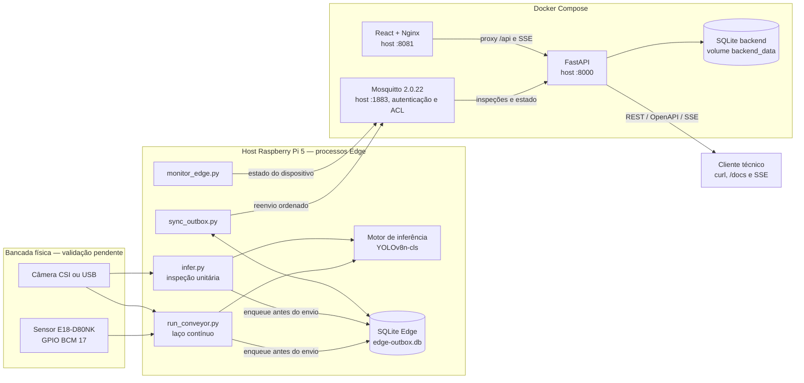
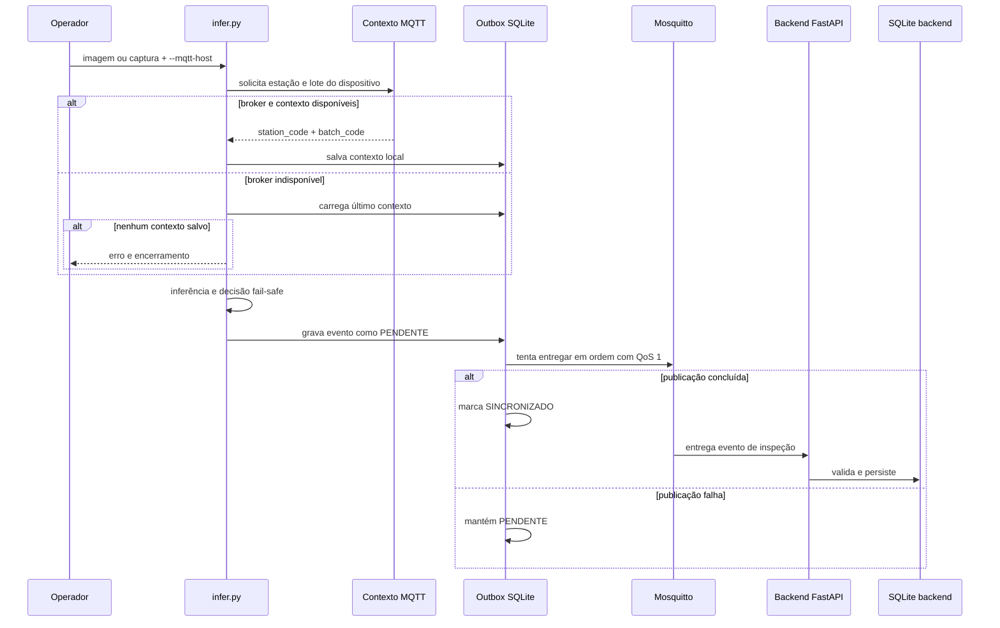
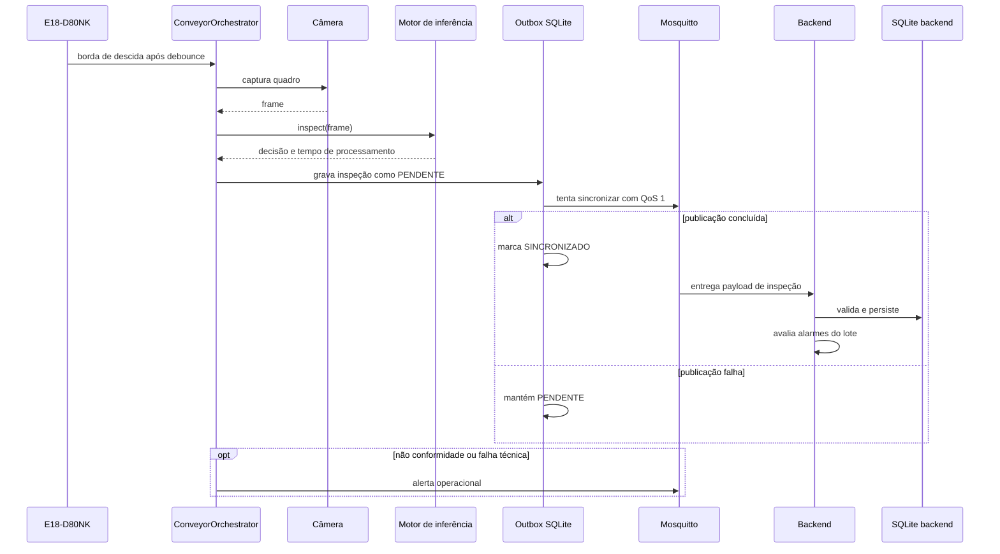

> **Projeto:** Vigi — Sistema Embarcado para Inspeção e Triagem de Linhas de Envase
> <br>**Revisão:** 0.8.1
> <br>**Data da revisão:** 16/09/2026
> <br>**Responsável:** Squad Vigi
> <br>**Base auditada:** `origin/main`, commit `f335140`
> <br>**Arquitetura-alvo:** versão destinada à `main`, sem LEDs e buzzer

# Arquitetura do Vigi

Este documento descreve a arquitetura destinada à entrega final. A sinalização
experimental por LEDs e buzzer foi desenvolvida em outra branch, mas a equipe
decidiu não integrá-la à `main`; por isso, ela não aparece nos fluxos nem nas
capacidades da arquitetura-alvo. O documento separa implementação de validação:
a presença do código não serve, sozinha, como evidência de funcionamento na
Raspberry Pi 5.

## Registro de alterações

| Versão | Data | Alteração |
| --- | --- | --- |
| 0.1.0 | 06/09/2026 | Diagrama inicial orientado a fluxo de dados |
| 0.2.0 | 06/09/2026 | Simplificação dos atuadores e proposta de buffer offline |
| 0.3.0 | 06/09/2026 | Inclusão do sensor E18-D80NK |
| 0.4.0 | 08/09/2026 | SQLite, FastAPI e proposta de dashboard React |
| 0.5.0 | 08/09/2026 | Topologia embarcada e primeiros contratos de dados |
| 0.6.0 | 16/09/2026 | Arquitetura atual do Edge/backend, outbox, estações, lotes, alarmes e SSE |
| 0.6.1 | 16/09/2026 | Exclusão da sinalização experimental por LEDs e buzzer da arquitetura destinada à `main` |
| 0.7.0 | 16/09/2026 | Integração da arquitetura com o dashboard React e a infraestrutura autenticada presentes na `main` |
| 0.8.0 | 16/09/2026 | Estação Edge modular, outbox no fluxo contínuo, captura configurável e inicialização local previsível |
| 0.8.1 | 16/09/2026 | Auditoria do esquemático incorporado pela `main`, mantendo relé e solenoide fora da arquitetura-alvo |

## Legenda de estado

| Estado | Interpretação neste documento |
| --- | --- |
| Implementado | Existe código executável no checkout |
| Testado automaticamente | Há teste com software ou dublê de hardware |
| Validação física pendente | Requer ensaio e evidência na Raspberry Pi 5 |
| Planejado | Não existe implementação completa neste checkout |

## Visão de contexto e implantação atual

O Edge é executado como processo Python no host da Raspberry Pi. O
[`compose.yaml`](../../compose.yaml) cria o broker Mosquitto, o backend FastAPI
e o dashboard React servido pelo Nginx; ele não cria um container para a câmera,
GPIO ou inferência. Essa separação permite que Picamera2/libcamera e GPIO Zero
acessem diretamente os dispositivos do sistema operacional.



### Limites de implantação

- O Compose publica MQTT em `MQTT_BIND_HOST` (`0.0.0.0` por padrão). O broker
  exige credenciais distintas para Edge e backend e restringe os tópicos por ACL.
- A API é publicada na porta 8000 do host e ainda não possui autenticação ou
  autorização.
- O fluxo iniciado por `make up` publica o dashboard na porta 8081; seu Nginx
  encaminha `/api/` ao backend.
- `/docs` é a documentação interativa OpenAPI e não substitui o dashboard.
- Imagens capturadas não são enviadas pelo payload MQTT. No modo contínuo, elas
  podem ser gravadas localmente em `captures/`.
- Dataset e pesos do modelo não ficam no Git; os ponteiros são versionados por
  DVC e a recuperação exige acesso autorizado ao remote.

## Dois fluxos de inspeção implementados

### 1. Inspeção unitária com outbox

[`scripts/infer.py`](../../scripts/infer.py) recebe uma imagem ou captura um
quadro. Quando `--mqtt-host` é informado, a CLI tenta obter do backend o contexto
de estação/lote retido no MQTT. Se o broker estiver indisponível, usa o último
contexto salvo. Sem contexto anterior, a primeira execução offline é recusada.



O processo separado [`scripts/sync_outbox.py`](../../scripts/sync_outbox.py)
repete a entrega das pendências e remove registros sincronizados há mais de 30
dias. Sem `--mqtt-host`, `infer.py` apenas imprime o evento e não cria registro
na outbox.

### 2. Operação contínua da esteira

[`scripts/run_conveyor.py`](../../scripts/run_conveyor.py) mantém câmera, sensor
e sessão MQTT abertos. Cada disparo passa pelo orquestrador, executa a inferência,
grava o evento na outbox e tenta sincronizá-lo com o broker. Resolução, FPS,
exposição, ganho, balanço de branco, atraso após o sensor e gravação das imagens
são configuráveis pela CLI e pelo `Makefile`.



Neste fluxo, o contexto de estação/lote vem dos argumentos da CLI (padrões
`ESTACAO_01` e `LOTE_01`). A inspeção usa `InspectionOutbox`; se a publicação
falhar, o evento permanece `PENDENTE`. Alertas operacionais continuam sendo
publicados separadamente e não possuem a mesma garantia de fila persistente.

## Organização do código

O backend é um monólito modular: uma única aplicação FastAPI reúne módulos de
negócio que compartilham banco, eventos e comunicação MQTT. Edge e Mosquitto
continuam sendo processos/componentes separados.

| Bloco | Responsabilidade | Origem principal |
| --- | --- | --- |
| Aquisição | Câmera CSI/USB e sensor fotoelétrico | `edge/acquisition/` |
| Inferência | Manifesto, adaptador do modelo e decisão fail-safe | `edge/inference/` |
| Mensageria Edge | Eventos, contexto, MQTT, status, outbox e sincronização | `edge/messaging/` |
| Orquestração | Ciclo sensor → câmera → inferência → outbox → MQTT | `edge/orchestration/` |
| Entrega da inspeção | Outbox, sincronização MQTT e alerta operacional | `edge/orchestration/inspection_dispatcher.py` |
| Capturas | Gravação opcional do quadro por inspeção | `edge/orchestration/capture_store.py` |
| Inspeções | DTOs, consulta, persistência e consumo MQTT | `backend/app/modules/inspections/` |
| Operações | Estações, lotes, limite de não conformidade e estado | `backend/app/modules/operations/` |
| Alarmes | Geração, consulta e reconhecimento de alarmes | `backend/app/modules/alarms/` |
| Infraestrutura | Configuração, SQLite, event bus e cliente MQTT | `backend/app/infrastructure/` |
| Eventos | Stream SSE em memória para clientes conectados | `backend/app/events/` |
| Dashboard | Supervisão React, consumo REST/SSE e proxy Nginx | `frontend/` |
| Evolução do banco | Migrations Alembic executadas no início do container | `backend/migrations/` |

## Persistência

Existem dois arquivos SQLite com papéis diferentes:

| Banco | Tabelas/conteúdo principal | Responsabilidade |
| --- | --- | --- |
| Edge — `data/edge-outbox.db` | `inspection_outbox`, `operational_context` | Preservar eventos pendentes dos fluxos unitário e contínuo e o último contexto estação/lote |
| Backend — `/app/data/vigi.db` no Compose | `inspections`, `stations`, `station_statuses`, `batches`, `alarms` | Consulta operacional, relacionamento de lote/estação e alarmes |

Os dois habilitam WAL e `busy_timeout`. A marca `SINCRONIZADO` existe apenas na
outbox. O backend considera persistido o evento que foi consumido e validado via
MQTT; receber confirmação de publicação no Edge não prova, sozinho, a gravação
no banco do backend.

## Contrato de inspeção

O contrato executável está em
[`edge/messaging/event.py`](../../edge/messaging/event.py) e
[`InspectionCreateDTO`](../../backend/app/modules/inspections/dto/inspection_create.py).
Exemplo válido de não conformidade:

```json
{
  "inspection_id": 1042,
  "timestamp": "2026-09-16T14:30:01.250000+00:00",
  "station_code": "ESTACAO_01",
  "batch_code": "LOTE_01",
  "result": "NAO_CONFORME",
  "category": "ANOMALIA_PRODUTO",
  "nonconformity_type": "SEM_TAMPA",
  "technical_failure_type": null,
  "confidence": 0.94,
  "processing_time_ms": 180.5,
  "model_format": "pytorch"
}
```

As combinações aceitas são:

- `CONFORME`: categoria e tipos de falha nulos;
- `NAO_CONFORME` + `ANOMALIA_PRODUTO`: um tipo entre `SEM_TAMPA`,
  `TAMPA_TORTA` ou `AMASSADO`;
- `NAO_CONFORME` + `FALHA_TECNICA`: um tipo entre `ERRO_CAPTURA`,
  `BAIXA_CONFIANCA` ou `ERRO_INFERENCIA`.

## Tópicos MQTT

| Tópico | Produtor | Consumidor | Observação |
| --- | --- | --- | --- |
| `vigi/estacoes/{station_code}/inspecoes` | Edge | Backend (`vigi/estacoes/+/inspecoes`) | Caminho contextual atual |
| `vigi/esteira/inspecoes` | Edge | Backend | Compatibilidade com o caminho legado |
| `vigi/dispositivos/{device_id}/configuracao` | Backend | CLI unitária | Contexto retido de estação/lote |
| `vigi/dispositivos/{device_id}/status` | `monitor_edge.py` | Backend | Estado retido de conexão, sensor, câmera e processamento |
| `vigi/esteira/status` | Laço contínuo | Consumidores MQTT | LWT/status legado do publicador contínuo |
| `vigi/esteira/alarmes` | Edge e backend | Consumidores MQTT | Hoje reúne alerta transitório do Edge e alarme de lote do backend, com contratos distintos |

A coexistência de dois formatos em `vigi/esteira/alarmes` é um limite do estado
atual. Um consumidor externo precisa diferenciá-los pelos campos ou a equipe
deve separar/versionar os tópicos antes de tratá-los como interface estável.

## API e eventos

| Método e rota | Função |
| --- | --- |
| `GET /health` | Verifica conexão com SQLite e MQTT |
| `GET /api/inspecoes` | Lista inspeções com paginação e filtros |
| `GET /api/inspecoes/resumo` | Resume as inspeções filtradas |
| `GET /api/inspecoes/{id_inspecao}` | Confirma a persistência de uma inspeção |
| `POST /api/estacoes` | Cadastra estação/dispositivo |
| `GET /api/estacoes` e `GET /api/estacoes/{id}` | Consulta estações |
| `GET /api/estacoes/{id}/status` | Consulta o último estado recebido do Edge |
| `POST /api/estacoes/{id}/lotes` | Cadastra lote na estação |
| `GET /api/estacoes/{id}/lotes` | Lista lotes da estação |
| `PUT /api/estacoes/{id}/lotes/{lote_id}/limite` | Define limite percentual e nome do alarme |
| `PUT /api/estacoes/{id}/lote-ativo` | Ativa lote e publica o contexto retido para o dispositivo |
| `GET /api/alarmes` | Lista alarmes persistidos |
| `POST /api/alarmes/{id}/reconhecer` | Registra reconhecimento no backend |
| `GET /api/eventos/stream` | Entrega SSE de inspeções, estados e alarmes enquanto o cliente está conectado |

O reconhecimento HTTP registra no backend que um alarme persistido foi tratado.
Ele não aciona nem silencia dispositivos físicos, pois a versão destinada à
`main` não inclui sinalização por LEDs ou buzzer.

## Estado das capacidades

| Capacidade | Código | Teste automático | Validação física |
| --- | --- | --- | --- |
| Sensor e debounce | Implementado | Presente | Pendente de evidência final |
| Captura CSI/USB | Implementada | Dublês e testes de integração de classe | Pendente de ensaio final |
| Inferência e fail-safe | Implementados | Presente | Pendente no hardware alvo para a entrega |
| Outbox das inspeções unitária e contínua | Implementada | Presente | Pendente de ensaio de queda/reconexão |
| MQTT → backend → SQLite → API | Implementado | Teste de integração disponível | Reexecutar com broker isolado no SHA final |
| Estações, lotes e alarmes | Implementados | Presente | Pendente de cenário integrado final |
| SSE | Implementado | Presente | Pendente com cliente real |
| Dashboard React | Implementado | Build e lint disponíveis | Pendente de ensaio integrado na Raspberry Pi 5 |
| Autenticação/autorização | Planejada | Ausente | Ausente |

## Documentos relacionados

- [README — instalação, execução e resultados](../../README.md)
- [Matriz da Entrega 6](../entrega-6/README.md)
- [Regras de negócio](../requisitos/01-regras-de-negocio.md)
- [Requisitos funcionais](../requisitos/02-requisitos-funcionais.md)
- [Requisitos não funcionais](../requisitos/03-requisitos-nao-funcionais.md)
- [Requisitos técnicos](../requisitos/05-requisitos-tecnicos.md)
