> **Projeto:** Vigi — Sistema Embarcado para Inspeção e Triagem de Linhas de Envase  
> **Revisão:** 0.4.0  
> **Responsável:** Squad Vigi (Lead: Elder Rayan Oliveira Silva)  
> **Milestone:** Estruturação de Requisitos e Design Arquitetural

---

### Registro de Alterações

| Versão | Responsável | Data | Alterações |
| :--- | :--- | :--- | :--- |
| **0.1.0** | Squad Vigi | 06/09/2026 | Elaboração inicial do Diagrama Arquitetural orientado a Fluxo de Dados (Pressman). |
| **0.2.0** | Squad Vigi | 06/09/2026 | Simplificação de atuadores físicos e inclusão de buffer offline. |
| **0.3.0** | Squad Vigi | 06/09/2026 | Integração do sensor fotoelétrico infravermelho E18-D80NK. |
| **0.4.0** | Squad Vigi | 06/09/2026 | Atualização do armazenamento local para banco SQLite e dashboard de supervisão para FastAPI e React. |

---

## 🏛️ Visão Geral da Arquitetura

A arquitetura do sistema **Vigi** adota o modelo de **Design Orientado ao Fluxo de Dados** (*Roger S. Pressman*), estruturada em três camadas modulares e desacopladas:

1. **Camada de Entradas (*Inputs*):** Detecção de presença física pelo sensor fotoelétrico infravermelho **E18-D80NK** e aquisição instantânea de imagem sob demanda pela câmera digital.
2. **Camada de Processamento (*Edge Node — Raspberry Pi 5*):** 
   * Tratamento de sinal digital com filtro de *debounce* (30-100 ms);
   * Captura sincronizada de quadro no plano focal de inspeção;
   * Inferência de Inteligência Artificial (*Edge AI*);
   * Lógica de decisão preventiva (*Fail-Safe*);
   * Gravação transacional segura no banco de dados local **SQLite**.
3. **Camada de Saídas (*Outputs*):** Publicação assíncrona orientada a eventos via protocolo **MQTT** para o Broker Mosquitto, consumo pelo FastAPI e visualização de indicadores no **Dashboard React** em tempo real.

---

## 📊 Diagrama Arquitetural (Fluxo de Dados)

<p align="center">
  
</p>

### Representação em Bloco Lógico (Mermaid)

```mermaid
flowchart LR
    subgraph ENTRADAS["1. Camada de Entradas (Ambiente Físico)"]
        direction TB
        S1["Sensor Fotoelétrico IR E18-D80NK<br/><i>(Gatilho Digital NPN via GPIO)</i>"]
        S2["Câmera Digital / RPi Cam<br/><i>(Captura de Frame sob Demanda)</i>"]
    end

    subgraph PROCESSAMENTO["2. Camada de Processamento (Edge Node - Raspberry Pi 5)"]
        direction TB
        P1["Filtro de Debounce & Sincronização<br/><i>(30 ms a 100 ms / RNF08)</i>"]
        P2["Motor de Visão & Inferência Edge AI<br/><i>(OpenCV + Modelo Classificador)</i>"]
        P3["Motor de Decisão & Fail-Safe<br/><i>(Conforme vs. Não-Conforme / RN02)</i>"]
        P4["Banco de Dados Local SQLite<br/><i>(Transações ACID / Retenção 30 dias)</i>"]
        
        P1 -->|Disparo de Captura| P2
        P2 -->|Score de Confiança| P3
        P3 -->|Gravação do Evento| P4
    end

    subgraph SAIDAS["3. Camada de Saídas (IoT & Supervisão)"]
        direction TB
        O1["Cliente Publicador MQTT<br/><i>(Payloads JSON Assíncronos)</i>"]
        O2["Broker Mosquitto<br/><i>(Distribuição de Tópicos)</i>"]
        O3["Backend FastAPI<br/><i>(Consumidor MQTT, API REST e SSE)</i>"]
        O4["Dashboard Web React<br/><i>(Chart.js, Lucide e SCSS)</i>"]
        
        O1 -->|Wi-Fi TCP/IP| O2
        O2 -->|MQTT| O3
        O3 -->|HTTP / SSE| O4
    end

    S1 -->|Interrupção Digital| P1
    S2 -->|Frame Sincronizado| P2
    P3 -->|Evento de Inspeção| O1
    P4 -.->|Sincronização Pós-Queda| O1
```



---

## 🔍 Detalhamento das Camadas

### 1. Camada de Entradas (*Inputs*)
* **Sensor Fotoelétrico Infravermelho E18-D80NK:** Instalado na lateral da esteira. Ao detectar a passagem da garrafa, fecha contato para nível lógico baixo (NPN), gerando uma interrupção na GPIO da Raspberry Pi 5.
* **Câmera Digital (RPi Camera Module / USB HD):** Acionada sob demanda apenas no instante em que o frasco está centralizado no plano de teste.

### 2. Camada de Processamento (*Edge Node — Raspberry Pi 5*)
* **Debounce & Sincronização:** Filtra oscilações eletromecânicas do sinal do sensor E18-D80NK (30 a 100 ms, conforme [RNF08](../requisitos/03-requisitos-nao-funcionais.md)).
* **Pipeline de Visão & Edge AI:**
  * Pré-processamento e normalização do frame;
  * Classificação visual (ausência de tampa, tampa desalinhada/torta, frasco amassado ou conforme) com acurácia mínima de 90% ([RNF06](../requisitos/03-requisitos-nao-funcionais.md)).
* **Mecanismo de Decisão & *Fail-Safe*:**
  * Em caso de baixa confiança ou falha de leitura, o recipiente é preventivamente marcado como não-conforme ([RN02](../requisitos/01-regras-de-negocio.md)).
* **Persistência Local com SQLite (*Offline-First*):**
  * Cada ciclo de inspeção é gravado em banco relacional SQLite local com garantia ACID (evitando corrupção em quedas de energia) e mantido por até 30 dias ([RN04](../requisitos/01-regras-de-negocio.md), [RN10](../requisitos/01-regras-de-negocio.md), [RNF03](../requisitos/03-requisitos-nao-funcionais.md)). O campo `sync_status` gerencia a fila de envio e retransmissão ordenada ao broker MQTT ([RNF04](../requisitos/03-requisitos-nao-funcionais.md)).

### 3. Camada de Saídas (*IoT & Supervisão*)
* **Publicador MQTT:** Envia assincronamente as mensagens JSON para o broker central via Wi-Fi sem bloquear o laço de inspeção.
* **Backend FastAPI:** Consome os eventos do broker Mosquitto, disponibiliza consultas REST e envia atualizações em tempo real por SSE.
* **Dashboard React:** Interface conectada exclusivamente à API FastAPI, com gráficos em Chart.js, ícones Lucide e estilos SCSS ([US02](../requisitos/02-requisitos-funcionais.md), [US03](../requisitos/02-requisitos-funcionais.md), [RNF11](../requisitos/03-requisitos-nao-funcionais.md)).

### Separação entre backend e frontend

O **backend e toda a camada de dados** utilizam Python: processamento de imagens, inferência, publicação e consumo MQTT, persistência SQLite, validações e API FastAPI. Manter essas responsabilidades no mesmo ecossistema simplifica a comunicação com o modelo e evita duplicar regras em linguagens diferentes.

O **frontend** utiliza JavaScript com React e não acessa diretamente MQTT nem SQLite. Ele recebe dados do FastAPI por REST/SSE. O React favorece a composição de telas por componentes, atualizações incrementais em tempo real e a integração com Chart.js e Lucide, recursos adequados ao dashboard operacional do Vigi.

---

## ⏱️ Pipeline Temporal de Inspeção

```text
[T0: Presença Física] ──> [T1: Gatilho & Captura] ──> [T2: Inferência Edge AI] ──> [T3: Decisão & SQLite] ──> [T4: Publicação MQTT] ──> [T5: FastAPI + React]
   (Sensor E18-D80NK)       (Câmera + Debounce)          (Raspberry Pi 5)             (Persistência Local)            (Broker Wi-Fi)             (Painel Visual)
       
|<─────────────────────────────────────────────────── Latência Total < 500 ms (RNF01) ───────────────────────────────────────────────────>|
```

---

## 🗄️ Estrutura da Tabela de Persistência Local (SQLite)

```sql
CREATE TABLE IF NOT EXISTS inspecoes (
    id INTEGER PRIMARY KEY AUTOINCREMENT,
    timestamp DATETIME DEFAULT CURRENT_TIMESTAMP,
    resultado VARCHAR(20) NOT NULL,       -- 'CONFORME' | 'NAO_CONFORME'
    categoria VARCHAR(30),                -- 'ANOMALIA_PRODUTO' | 'FALHA_TECNICA' | NULL
    codigo VARCHAR(50),                   -- tipos de anomalia ou falha técnica
    confianca REAL NOT NULL,             -- Ex: 0.96
    tempo_processamento_ms INTEGER,      -- Ex: 185
    sync_status VARCHAR(20) DEFAULT 'PENDENTE' -- 'PENDENTE' | 'SINCRONIZADO'
);
```

---

## 📡 Mapeamento de Tópicos MQTT

### 1. Tópico de Inspeções: `vigi/esteira/inspecoes`
```json
{
  "id_inspecao": 1042,
  "timestamp": "2026-09-06T14:30:01.250Z",
  "resultado": "NAO_CONFORME",
  "categoria": "ANOMALIA_PRODUTO",
  "codigo": "SEM_TAMPA",
  "confianca": 0.94,
  "tempo_processamento_ms": 180
}
```

### 2. Tópico de Alarmes de Linha: `vigi/esteira/alarmes`
```json
{
  "tipo_alarme": "FALHAS_RECORRENTES",
  "contagem_consecutiva": 4,
  "severidade": "ALTA",
  "timestamp": "2026-09-06T14:32:00.100Z"
}
```

### 3. Tópico de Status do Dispositivo (*LWT*): `vigi/esteira/status`
```json
{
  "status": "ONLINE",
  "uptime_segundos": 3600,
  "registros_pendentes_sync": 0
}
```

---

## 📄 Documentos Relacionados

* [01. Regras de Negócio](../requisitos/01-regras-de-negocio.md)
* [02. Requisitos Funcionais](../requisitos/02-requisitos-funcionais.md)
* [03. Requisitos Não-Funcionais](../requisitos/03-requisitos-nao-funcionais.md)
* [05. Requisitos Técnicos e Justificativas](../requisitos/05-requisitos-tecnicos.md)
