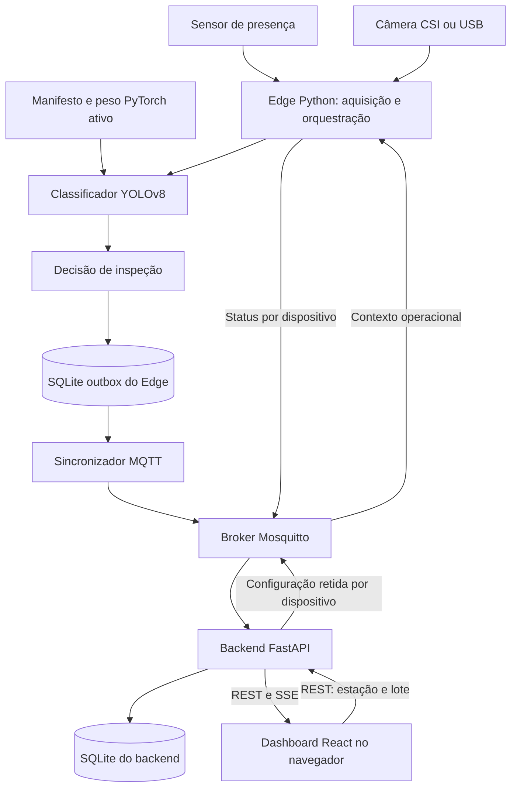
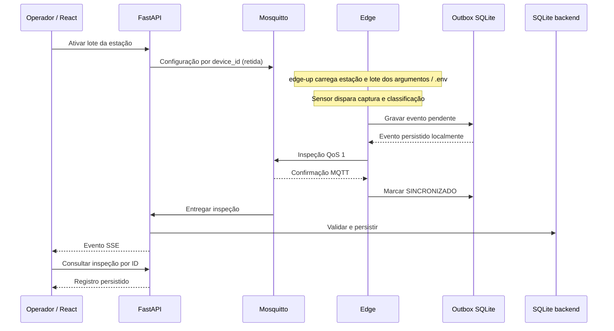

# Arquitetura implementada do Vigi

Este documento descreve o código entregue. Diagramas não certificam montagem elétrica, desempenho ou operação física: essas verificações permanecem dependentes de ensaio na bancada. Consulte o [manual de execução](../../README.md) e o [manual elétrico](../esquematico/esquematico-eletrico.md).

## Componentes e responsabilidades



- **Edge:** `edge/acquisition` captura imagens e lê o sensor; `edge/inference` classifica e aplica a decisão; `edge/orchestration` coordena o ciclo; `edge/messaging` implementa eventos, contexto, status e entrega. Os scripts oferecem inferência pontual e execução contínua. Não há atuação de rejeição mecânica implementada.
- **Artefatos:** o manifesto seleciona o checkpoint operacional PyTorch `.pt`. Dataset e pesos são recuperados por DVC; não se presume que estejam presentes no clone. Treinamento é um fluxo separado da operação.
- **Backend:** monólito modular FastAPI com módulos de inspeções, operações e alarmes. Consome MQTT, valida DTOs, persiste entidades e expõe REST/SSE. Não consulta o arquivo da outbox do Edge.
- **Frontend:** aplicação React implementada, com estações, lotes, inspeções, indicadores, status e alarmes. Consome a API; não acessa MQTT ou SQLite diretamente.
- **Implantação:** broker, backend e frontend são serviços separados; o Edge executa no dispositivo conectado ao hardware. Serviços podem estar em outro host alcançável pela rede. Processamento local não implica autenticação de todas as interfaces nem operação validada sem rede.

## Sequência de inspeção e confirmação



A confirmação MQTT é confirmação de publicação no broker, **não** confirmação de persistência no backend. A sequência entre confirmação ao Edge e entrega ao backend pode variar. Consulte o mesmo `inspection_id` pela API para comprovar o percurso. Falhas de validação ou indisponibilidade do consumidor exigem diagnóstico; não existe confirmação transacional ponta a ponta.

## Dois bancos com funções distintas

O processo `make edge-up` usa estação/lote recebidos na inicialização; após
alterar o lote no painel, atualize `BATCH_CODE` e reinicie o Edge. A CLI
`scripts/infer.py` tenta obter contexto MQTT, mas seu receptor não configura
credenciais atualmente. Veja o teste autenticado por imagem no README.

| Banco | Conteúdo e responsabilidade |
|---|---|
| SQLite do Edge | `inspection_outbox`: sequência, ID único, tópico, JSON, criação, sincronização e estado `PENDENTE`/`SINCRONIZADO`; `operational_context`: última estação e lote conhecidos. |
| SQLite do backend | Entidades operacionais, inspeções e alarmes usados pela API e pelo painel. Configurado por `DATABASE_URL`; padrão `sqlite+aiosqlite:///./data/vigi.db`. |

A outbox tenta entregar pendentes por ordem e interrompe a tentativa ao ocorrer erro. A limpeza remove registros sincronizados expirados; registros pendentes não são descartados por essa rotina. Retenção configurada não equivale a garantia de capacidade de disco. Contexto persistido permite recuperação sem broker quando disponível; a primeira operação ainda exige um contexto válido. A CLI sem MQTT pode apenas imprimir a decisão, portanto não comprova persistência ou entrega.

## Contratos MQTT

Os valores abaixo são os padrões do código; variáveis de ambiente podem alterar as inscrições do backend. `station_code` é o código textual da estação, não seu ID numérico no banco.

| Tópico padrão | Direção e contrato |
|---|---|
| `vigi/estacoes/{station_code}/inspecoes` | Edge → backend; `InspectionEvent` / `InspectionCreateDTO`, QoS 1, sem retenção. Backend assina `vigi/estacoes/+/inspecoes`. |
| `vigi/dispositivos/{device_id}/configuracao` | Backend → Edge; `OperationalContextDTO`, QoS 1 e mensagem retida ao ativar lote. |
| `vigi/dispositivos/{device_id}/status` | Edge → backend; `DeviceStatusMessageDTO`, QoS 1 e retenção, incluindo desconexão via Last Will. |
| `vigi/esteira/inspecoes` | Compatibilidade com publicador/CLI legado; backend mantém inscrição e aceita contrato com estação/lote ambos ausentes. Não usar como padrão para novas estações. |
| `vigi/esteira/alarmes` | Backend publica alarmes gerados por inspeções; payload `AlarmResponseDTO`. O publicador Edge também possui método para alarmes, o que não implica consumo desses alarmes pelo backend. |
| `vigi/esteira/status` | Status legado disponível no publicador de inspeção; não substitui status por dispositivo e não integra a inscrição atual do backend. |

### Inspeção (exemplo ilustrativo, não medição)

```json
{
  "inspection_id": 1758067200000001,
  "timestamp": "2026-09-17T00:00:00Z",
  "station_code": "ESTACAO-01",
  "batch_code": "LOTE-01",
  "result": "NAO_CONFORME",
  "category": "ANOMALIA_PRODUTO",
  "nonconformity_type": "SEM_TAMPA",
  "technical_failure_type": null,
  "confidence": 0.95,
  "processing_time_ms": 100.0,
  "model_format": "pytorch"
}
```

O ID é inteiro positivo; confiança fica entre 0 e 1; tempo é não negativo. Estação e lote devem ser informados juntos. `CONFORME` exige categoria e tipos de falha nulos. `NAO_CONFORME` exige `ANOMALIA_PRODUTO` com `SEM_TAMPA`, `TAMPA_TORTA` ou `AMASSADO`, ou `FALHA_TECNICA` com `ERRO_CAPTURA`, `BAIXA_CONFIANCA` ou `ERRO_INFERENCIA`. O contrato rejeita campos extras. Confiança não é acurácia, e tempo de processamento não certifica latência do ciclo físico.

### Configuração e status (exemplos ilustrativos)

```json
{"station_code": "ESTACAO-01", "batch_code": "LOTE-01"}
```

```json
{
  "device_id": "EDGE-01",
  "connection": "ONLINE",
  "sensor": "ONLINE",
  "camera": "IDLE",
  "processing": "IDLE",
  "timestamp": "2026-09-17T00:00:00Z"
}
```

Os estados admitidos pelo DTO são `ONLINE`, `IDLE`, `OFFLINE` e `ERROR`. Status representa o que o processo reporta; não prova a integridade elétrica do componente. O recebimento do contexto na inicialização e a sua persistência não devem ser interpretados como aplicação dinâmica garantida de toda troca de lote: confira o procedimento operacional de reinício e configuração.

### Alarmes

O payload de resposta contém `id`, `station_id`, `batch_id`, `alarm_type`, `name`, `rate`, `threshold`, `status`, `created_at`, `acknowledged_at` e `acknowledged_by`. Datas de reconhecimento e responsável podem ser nulos. Consulte os DTOs de alarmes e as rotas REST para criação e reconhecimento; não confunda esse payload com uma inspeção.

## Fontes do contrato e verificação

- [Evento Edge](../../edge/messaging/event.py), [outbox](../../edge/messaging/outbox.py) e [contexto](../../edge/messaging/context.py).
- [Inscrição MQTT do backend](../../backend/app/main.py) e [configuração](../../backend/app/config.py).
- [DTO de inspeção](../../backend/app/modules/inspections/dto/inspection_create.py), [status](../../backend/app/modules/operations/dto/device_status.py) e [alarmes](../../backend/app/modules/alarms/dto.py).

Metas de desempenho e disponibilidade nos requisitos continuam sendo metas até haver relatório de ensaio correspondente. A imagem histórica `docs/img/Fluxo.jpeg` não representa a arquitetura atual; os diagramas deste documento são a referência vigente.
