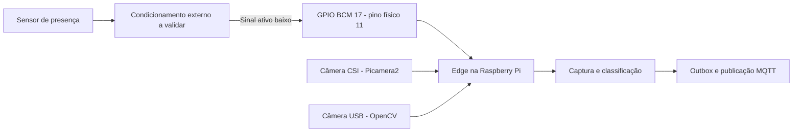
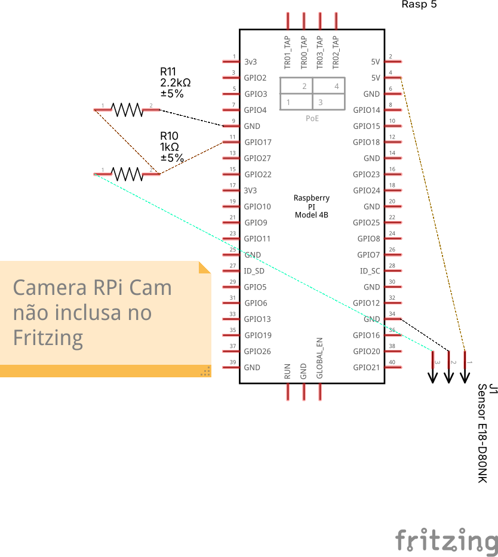

# Hardware e interfaces da estação Vigi

Este guia descreve as interfaces exigidas pelo software entregue. **A montagem elétrica não foi validada nesta revisão documental.** O desenho Fritzing legado é preservado como referência histórica; não constitui um circuito aprovado para energização. A reprodução física completa permanece pendente da revisão do circuito e de ensaio na bancada.

O sistema captura imagens quando detecta um recipiente, classifica e publica a inspeção. Não há controle implementado de cargas de potência ou descarte automático. O movimento da esteira, sua alimentação e seu comando são externos ao software atual.

## Componentes e evidência disponível

| Item | Quantidade | Evidência e limite |
| --- | --- | --- |
| Raspberry Pi 5 | 1 | Plataforma prevista no projeto; capacidade de RAM e funcionamento físico não foram aferidos nesta revisão. |
| Sensor fotoelétrico E18-D80NK | 1 | Identificado em `edge/acquisition/sensor.py`; fabricante, variante, alimentação e características elétricas da unidade física precisam ser confirmados. |
| Câmera CSI ou USB | 1 | Backends Picamera2 e OpenCV implementados; modelo, cabo, resolução útil e compatibilidade devem ser registrados na bancada. |
| Fonte e armazenamento da Raspberry | 1 de cada | Selecionar conforme a placa e os periféricos efetivos; registrar modelo e capacidade utilizados. |
| Condicionamento elétrico e interligações | A definir | Necessários para entregar níveis compatíveis à entrada GPIO; circuito, valores e tolerâncias pendentes de validação. |
| Suporte, iluminação e transporte de recipientes | Conforme montagem | Devem manter posição e iluminação reproduzíveis; não são atuados pelo código. |

Os valores dos componentes presentes nos artefatos antigos não integram uma BOM elétrica validada e precisam ser confirmados contra a montagem real.

## Diagrama de interfaces implementadas

O diagrama abaixo é uma descrição funcional versionável, **não um esquemático elétrico de montagem**. Ele não define alimentação, pinagem do sensor nem o circuito de condicionamento.



Use uma das alternativas de câmera. O código não comanda atuador de descarte.

## Pinagem e comportamento esperado pelo software

**BCM é o número lógico usado pelo software; pino físico é a posição no conector.** O padrão `GPIO_PIN=17` indica BCM 17, correspondente ao pino físico 11, e não ao pino físico 17. A orientação do conector precisa ser conferida antes da conexão.

| Interface | Configuração implementada | Procedimento / limite |
| --- | --- | --- |
| Entrada do sensor | BCM 17, pino físico 11, por padrão | Recebe somente a saída do condicionamento elétrico previamente validado. A alteração de `GPIO_PIN` exige conferir o novo mapeamento físico. |
| Referência elétrica | GND, por exemplo pino físico 6 | O circuito de interface deve especificar sua referência; não deduzir o retorno pela cor dos fios. |
| Alimentação do sensor | Não definida pelo software | Conferir datasheet da variante e projetar alimentação e retorno antes de ligar. Não usar a tabela histórica como aprovação. |
| Câmera CSI | `CAMERA_BACKEND=picamera2`, `CAMERA=0` por padrão | Confirmar cabo e conector compatíveis com a Raspberry Pi 5 e a câmera. Conectar com alimentação desligada. |
| Câmera USB | `CAMERA_BACKEND=opencv`, índice em `CAMERA` | Conferir qual dispositivo corresponde ao índice e seu acesso pelo usuário do Edge. |

A classe `PhotoelectricSensor` instancia `DigitalInputDevice` com `pull_up=None` e `active_state=False`: a entrada precisa ter estado elétrico definido pelo circuito externo. Embora a assinatura da classe tenha um argumento `pull_up`, esse argumento não configura o dispositivo na implementação atual. Não presumir pull-up interno habilitado.

- Sem recipiente: o software espera entrada inativa, em nível alto compatível com a GPIO.
- Com recipiente: o software espera nível baixo; a ativação gera um evento de captura.
- `DEBOUNCE_MS=50` é o padrão; a classe aceita de 30 a 100 ms.
- Há bloqueio de novos gatilhos por 0,2 s após o último gatilho aceito (`rearm_delay_s`). Isso não comprova uma peça por evento nem a vazão máxima da linha: espaçamento, velocidade e posição precisam de ensaio.

Esses parâmetros são filtros de software. Não comprovam sincronismo físico, latência ponta a ponta ou eliminação de todos os disparos espúrios.

## Artefatos elétricos históricos — NÃO validados



- [Projeto Fritzing legado](./VigiEsquematico.fzz).

A documentação anterior atribuía ao divisor de 1 kΩ e 2,2 kΩ uma tensão nominal de aproximadamente 3,44 V para entrada de 5 V e declarava esse resultado seguro. **Essa declaração foi retirada:** o cálculo nominal não valida compatibilidade elétrica, tolerâncias ou transientes. A topologia real da saída do sensor também precisa ser confirmada; não presumir que toda variante forneça a mesma saída.

Antes de ligar qualquer saída à GPIO, o responsável pela bancada deve documentar o circuito definitivo, referências dos componentes, limites do fabricante e medições de nível alto/baixo. O desenho existente precisa ser corrigido e acompanhado dessas evidências. Este guia não fornece um circuito substituto sem essa verificação.

### Resultado da auditoria do diagrama

Auditoria documental realizada em 17/09/2026 sobre a imagem PNG, o projeto
Fritzing e o contrato do software. Ela verifica a coerência dos arquivos, mas
não substitui revisão por responsável pela montagem, medição elétrica ou ensaio
na Raspberry Pi.

| Item verificado | Evidência encontrada | Parecer |
| --- | --- | --- |
| Placa representada | O projeto Fritzing usa o componente `raspberry-pi-4B_1`, embora o título visual seja “Rasp 5”. | Inconsistente: substituir pelo componente da placa efetiva e conferir novamente a pinagem. |
| Entrada usada pelo software | O nó intermediário do divisor chega ao `connector10` do componente Fritzing, correspondente ao BCM 17/pino físico 11; `GPIO_PIN=17` é o padrão do software. | Coerente apenas quanto ao pino lógico pretendido. |
| Condicionamento do sinal | O arquivo liga a saída representada do sensor ao resistor de 1 kΩ, o nó da GPIO entre 1 kΩ e 2,2 kΩ e o resistor de 2,2 kΩ ao retorno. | A topologia de divisor é identificável, mas não está eletricamente aprovada. |
| Nível de tensão | Para 5 V na entrada, os valores desenhados produzem aproximadamente 3,44 V nominais, antes de considerar tolerâncias e transientes. | Reprovado para conexão à GPIO até que um circuito compatível com 3,3 V seja especificado e medido. |
| Terminais do E18-D80NK | O conector de três vias é nomeado, mas cada terminal não é rotulado com função, cor do cabo ou tensão esperada. | Ambíguo e insuficiente para montagem por terceiros. |
| Câmera | A própria imagem informa que a câmera não está incluída no Fritzing. | A conexão CSI/USB deve seguir o manual da placa e da câmera escolhidas. |
| Evidência física | Não há nesta revisão registro de medições, foto comparável ao circuito definitivo ou ensaio de detecção na placa. | Validação física pendente. |

**Conclusão:** os artefatos históricos estão **reprovados como instrução de
montagem ou energização**. Eles registram a intenção anterior, mas não satisfazem
sozinhos o requisito de um esquemático elétrico reprodutível. Para aprovação,
é necessário corrigir a placa representada, rotular todos os terminais,
substituir ou justificar o condicionamento com base nos datasheets da variante
real e anexar medições dos níveis alto e baixo antes de conectar a GPIO.

## Preparação, montagem e verificação

1. Identificar a placa, a câmera, o cabo, a fonte e a variante do sensor. Registrar fotos legíveis e datasheets; verificar a numeração física do conector.
2. Com a Raspberry e o sensor desligados, fixar câmera e sensor de forma que a detecção corresponda à região enquadrada. Instalar a câmera usando a interface escolhida e o cabo correto. Manter alimentação e controle da esteira documentados separadamente.
3. Revisar e documentar o condicionamento externo. Com a GPIO desconectada, medir os níveis de saída com e sem recipiente e avaliar tolerâncias e comportamento na energização. **Não prosseguir para a conexão GPIO enquanto a compatibilidade não estiver demonstrada.**
4. Desligar as alimentações e interligar a saída validada à BCM 17/pino 11 e a referência conforme o circuito aprovado. Não conectar sinal de 5 V diretamente à GPIO.
5. Preparar o ambiente e recuperar o modelo conforme o [README](../../README.md). Conferir `GPIO_PIN`, `DEBOUNCE_MS`, `CAMERA_BACKEND` e `CAMERA` antes de executar.
6. Executar `make preview-camera` para ajustar o enquadramento. Encerrar esse processo antes de `make edge-up`, pois a câmera pode não aceitar dois consumidores simultâneos.
7. Para verificar o sensor isoladamente, sem disputa com o processo Edge, executar o diagnóstico abaixo. Colocar e retirar um recipiente: esperar alternância de `False` para `True` e retorno a `False`.
8. Encerrar o diagnóstico e iniciar `make edge-up`. Passar recipientes individualmente e conferir inspeção nos logs e sua chegada ao backend/dashboard conforme o README. Repetir com intervalos e condições de iluminação documentados.

Após preparar o ambiente Python do Edge, executar na raiz do repositório:

```bash
.venv/bin/python - <<'PY'
import time
from edge.acquisition.sensor import PhotoelectricSensor

sensor = PhotoelectricSensor(pin=17, debounce_ms=50)
try:
    while True:
        print('Recipiente detectado:', sensor.is_detected, flush=True)
        time.sleep(0.25)
except KeyboardInterrupt:
    pass
finally:
    sensor.close()
PY
```

Esse diagnóstico usa a BCM 17 explicitamente; ajustar o argumento se a montagem aprovada utilizar outro pino. Não chamar `trigger()` para validar hardware: esse método produz um evento sintético.

## Diagnóstico e evidências de aceitação física

| Sintoma | Verificação |
| --- | --- |
| Log informa “Operando em modo stub” | A inicialização GPIO falhou; verificar dependências, acesso à GPIO e execução na placa. O processo continuar aberto não comprova que há sensor funcional. |
| Sensor sempre inativo ou sempre ativo | Com o Edge parado, conferir alinhamento, alimentação, referência, níveis medidos, pino BCM e circuito externo. |
| Duas inspeções para uma peça ou peças não detectadas | Registrar espaçamento e velocidade; investigar sinal e posicionamento antes de ajustar debounce. Considerar o bloqueio de 0,2 s. |
| Câmera não abre | Conferir backend, índice, cabo e permissões; encerrar preview/coletor/outro processo que esteja usando a câmera. |
| Dashboard mostra sensor ONLINE, mas não detecta peças | Esse estado publicado não substitui a verificação elétrica; conferir logs de stub e transições físicas. |
| Classificação incorreta | Conferir foco, iluminação, posição e domínio do modelo; a revisão documental não valida acurácia na bancada. |

Registrar: versão do código/modelo, circuito definitivo, componentes, níveis medidos, parâmetros, fotos da montagem, quantidade de peças e eventos, perdas/duplicações e evidências de chegada ao backend. A confirmação MQTT não prova persistência no backend.

**Estado desta revisão:** contratos de software inspecionados; circuito, câmera, sensor, captura física, latência e operação ponta a ponta não ensaiados. Requisitos de desempenho permanecem metas até haver medições. Não há evidência nesta revisão para tempos específicos de inferência, posição milimétrica de captura ou descarte mecânico preventivo.
